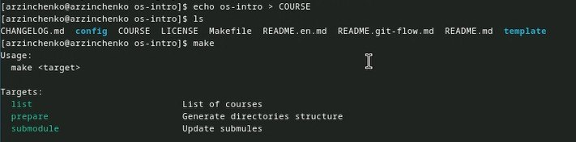

---
## Front matter
lang: ru-RU
title: Презентация
subtitle: по лабораторной работе № 2
author:
  - Зинченко А.Р
institute:
  - Российский университет дружбы народов, Москва, Россия
  - НБИбд-01-23
date: 29 февраля 2024

## i18n babel
babel-lang: russian
babel-otherlangs: english

## Formatting pdf
toc: false
toc-title: Содержание
slide_level: 2
aspectratio: 169
section-titles: true
theme: metropolis
header-includes:
 - \metroset{progressbar=frametitle,sectionpage=progressbar,numbering=fraction}
 - '\makeatletter'
 - '\beamer@ignorenonframefalse'
 - '\makeatother'
---

# Информация

## Докладчик

:::::::::::::: {.columns align=center}
::: {.column width="70%"}

  * Зинченко Анастасия Романовна
  * Студентка НБИбд-01-23
  * Российский университет дружбы народов
  * [1132231832@hfur.ru]

:::
::: {.column width="30%"}

:::
::::::::::::::

# Цель работы

Изучить идеологию и применение средств контроля версий и освоить умения по работе с git.

# Задание

1. Установка программного обеспечения
 а. Установка git
 б. Установка gh
2. Базовая настройка git
3. Создайте ключи ssh
4. Создайте ключи pgp
5. Настройка github
6. Добавление PGP ключа в GitHub
7. Настройка автоматических подписей коммитов git
8. Настройка gh
9. Шаблон для рабочего пространства
 а. Сознание репозитория курса на основе шаблона
 б. Настройка каталога курса

## Выполнение лабораторной работы

Установила git с помощью команды dnf install git.

{#fig:001 width=50%}

Установила gh с помощью команды dnf install gh.

{#fig:002 width=50%}

## Выполнение лабораторной работы

Задала имя и email своего репозитория с помощью команд 
git config --global user.name "Anastasiia"
git config --global user.email "zinchenkoa06zinchenko@yandex.ru".

{#fig:003 width=50%}

Настроила utf-8 в выводе сообщений git с помощью команды git config --global core.quotepath false.

{#fig:004 width=50%}

## Выполнение лабораторной работы

Задала имя начальной ветки с помощью команды git config --global init.defaultBranch master.

{#fig:005 width=50%}

Задала параметр autocrlf с помощью команды git config --global core.autocrlf input.

{#fig:006 width=50%}

## Выполнение лабораторной работы
 
Задала параметр safecrlf с помощью команды git config --global core.safecrlf warn.

{#fig:007 width=50%}

Создала ключ ssh по алгоритму rsa с ключём размером 4096 бит с помощью команды ssh-keygen -t rsa -b 4096.

{#fig:008 width=50%}

## Выполнение лабораторной работы
   
Создала ключ ssh по алгоритму ed25519 с помощью команды ssh-keygen -t ed25519.

{#fig:009 width=50%}

Сгенерировала ключ gpg с помощью команды gpg --full-generate-key.

{#fig:010 width=50%}

## Выполнение лабораторной работы

Из предложенных опций выбирала
 тип RSA and RSA;
 размер 4096;
 срок действия;
 имя;
 адрес электронной почты
            
У меня уже была создана учётная запись на Github и были заполнены основные данные.

{#fig:011 width=50%}

Вывела список ключей и скопировала отпечаток приватного ключа с помощью команды gpg --list-secret-keys --keyid-format LONG.

{#fig:012 width=50%}

## Выполнение лабораторной работы

Cкопировала сгенерированный PGP ключ в буфер обмена с помощью команды gpg --armor --export <PGP Fingerprint> | xclip -sel clip. Перешла в настройки GitHub, нажала на кнопку New GPG key и вставила полученный ключ в поле ввода.

{#fig:013 width=50%}

Используя zinchenkoa06zinchenko@yandex.ru, указала Git применять его при подписи коммитов с помощью команд
    git config --global user.signingkey <PGP Fingerprint>
    git config --global commit.gpgsign true
    git config --global gpg.program $(which gpg2).
    
{#fig:014 width=50%}

## Выполнение лабораторной работы

Я авторизовалась с помощью команды gh auth login.

{#fig:015 width=50%}

Я создала репозиторий с помощью команд 
    mkdir -p ~/work/study/2022-2023/"Операционные системы"
    cd ~/work/study/2022-2023/"Операционные системы"
    gh repo create study_2022-2023_os-intro --template=yamadharma/course-directory-student-template --public
    git clone --recursive git@github.com:<owner>/study_2022-2023_os-intro.git os-intro.
    
{#fig:016 width=50%}

## Выполнение лабораторной работы

Для того чтобы насторить каталог курса я перешла в каталог курса с помощью команды cd ~/work/study/2022-2023/"Операционные системы"/os-intro.

{#fig:017 width=50%}

Удалила лишние файлы с помощью команды rm package.json.

{#fig:018 width=50%}

## Выполнение лабораторной работы

Создала необходимые каталоги с помощью команд
  echo os-intro > COURSE
  make.
  
{#fig:019 width=50%}

Отправила файлы на сервер с помощью команд 
 git add .
 git commit -am 'feat(main): make course structure'
 git push.
 
{#fig:020 width=50%} 

Проверка файлов на сервере.

{#fig:021 width=50%} 

# Выводы

Я изучила идеологию и применение средств контроля версий и освоила умения по работе с git.

:::

