---
## Front matter
title: "Отчёт по лабораторной работе № 2"
subtitle: "НБИбд-01-23"
author: "Анастасия Романовна Зинченко"

## Generic otions
lang: ru-RU
toc-title: "Содержание"

## Bibliography
bibliography: bib/cite.bib
csl: pandoc/csl/gost-r-7-0-5-2008-numeric.csl

## Pdf output format
toc: true # Table of contents
toc-depth: 2
lof: true # List of figures
lot: true # List of tables
fontsize: 12pt
linestretch: 1.5
papersize: a4
documentclass: scrreprt
## I18n polyglossia
polyglossia-lang:
  name: russian
  options:
	- spelling=modern
	- babelshorthands=true
polyglossia-otherlangs:
  name: english
## I18n babel
babel-lang: russian
babel-otherlangs: english
## Fonts
mainfont: PT Serif
romanfont: PT Serif
sansfont: PT Sans
monofont: PT Mono
mainfontoptions: Ligatures=TeX
romanfontoptions: Ligatures=TeX
sansfontoptions: Ligatures=TeX,Scale=MatchLowercase
monofontoptions: Scale=MatchLowercase,Scale=0.9
## Biblatex
biblatex: true
biblio-style: "gost-numeric"
biblatexoptions:
  - parentracker=true
  - backend=biber
  - hyperref=auto
  - language=auto
  - autolang=other*
  - citestyle=gost-numeric
## Pandoc-crossref LaTeX customization
figureTitle: "Рис."
tableTitle: "Таблица"
listingTitle: "Листинг"
lofTitle: "Список иллюстраций"
lotTitle: "Список таблиц"
lolTitle: "Листинги"
## Misc options
indent: true
header-includes:
  - \usepackage{indentfirst}
  - \usepackage{float} # keep figures where there are in the text
  - \floatplacement{figure}{H} # keep figures where there are in the text
---

# Цель работы

Изучить идеологию и применение средств контроля версий и освоить умения по работе с git.

# Задание

1. Установка программного обеспечения
 а. Установка git
 б. Установка gh
2. Базовая настройка git
3. Создайте ключи ssh
4. Создайте ключи pgp
5. Настройка github
6. Добавление PGP ключа в GitHub
7. Настройка автоматических подписей коммитов git
8. Настройка gh
9. Шаблон для рабочего пространства
 а. Сознание репозитория курса на основе шаблона
 б. Настройка каталога курса
10. Контрольные вопросы

# Выполнение лабораторной работы

Установила git с помощью команды dnf install git (рис. [-@fig:001]).

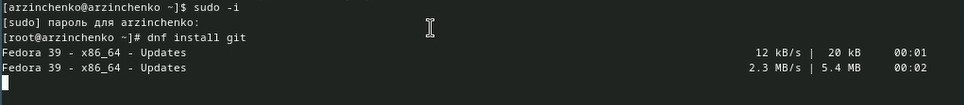{#fig:001 width=70%}

Установила gh с помощью команды dnf install gh (рис. [-@fig:002]).

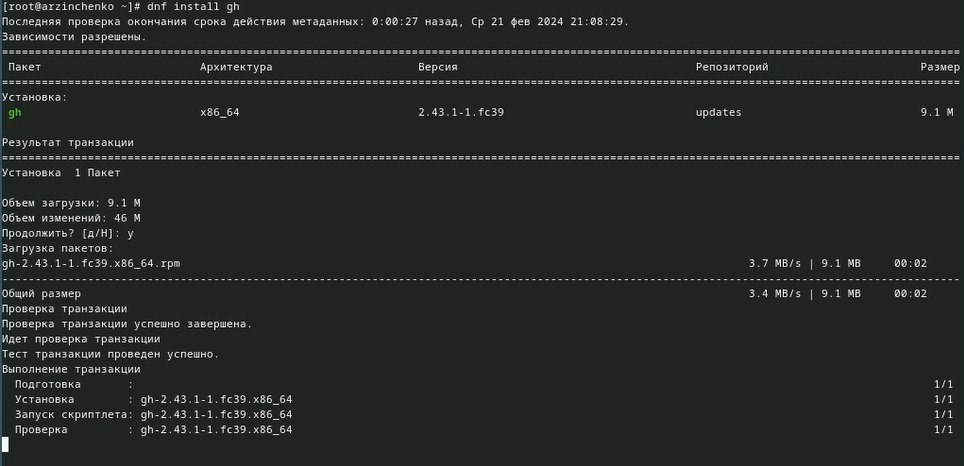{#fig:002 width=70%}

Задала имя и email своего репозитория с помощью команд 
git config --global user.name "Anastasiia"
git config --global user.email "zinchenkoa06zinchenko@yandex.ru" (рис. [-@fig:003]).

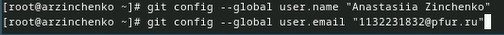{#fig:003 width=70%}

Настроила utf-8 в выводе сообщений git с помощью команды git config --global core.quotepath false (рис. [-@fig:004]).

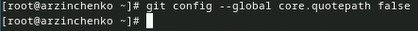{#fig:004 width=70%}

Задала имя начальной ветки с помощью команды git config --global init.defaultBranch master (рис. [-@fig:005]).

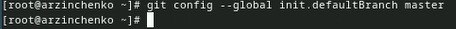{#fig:005 width=70%}

Задала параметр autocrlf с помощью команды git config --global core.autocrlf input (рис. [-@fig:006]).

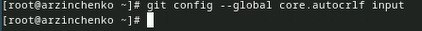{#fig:006 width=70%}
 
Задала параметр safecrlf с помощью команды git config --global core.safecrlf warn (рис. [-@fig:007]).

{#fig:007 width=70%}

Создала ключ ssh по алгоритму rsa с ключём размером 4096 бит с помощью команды ssh-keygen -t rsa -b 4096 (рис. [-@fig:008]).

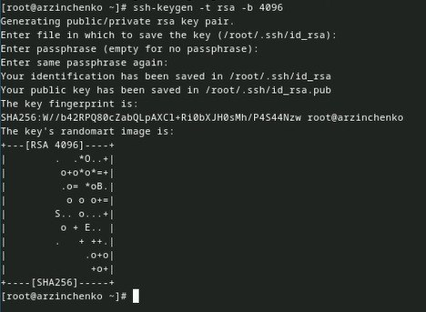{#fig:008 width=70%}
   
Создала ключ ssh по алгоритму ed25519 с помощью команды ssh-keygen -t ed25519 (рис. [-@fig:009]).

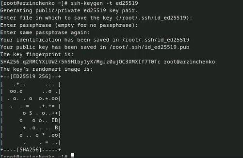{#fig:009 width=70%}

Сгенерировала ключ gpg с помощью команды gpg --full-generate-key (рис. [-@fig:010]).

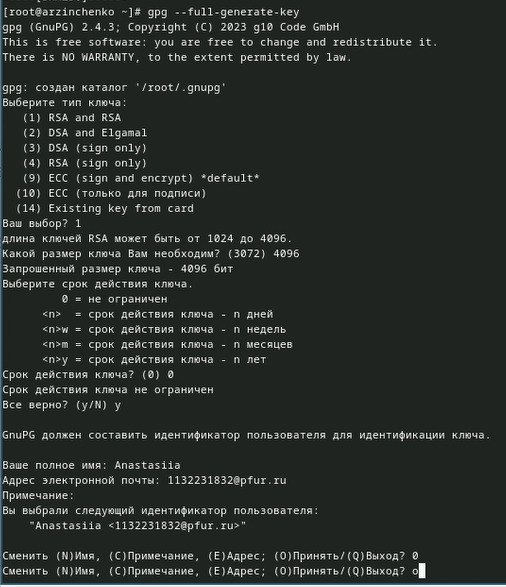{#fig:010 width=70%}

Из предложенных опций выбирала
 тип RSA and RSA;
 размер 4096;
 срок действия;
 имя;
 адрес электронной почты
            
У меня уже была создана учётная запись на Github и были заполнены основные данные (рис. [-@fig:011]).

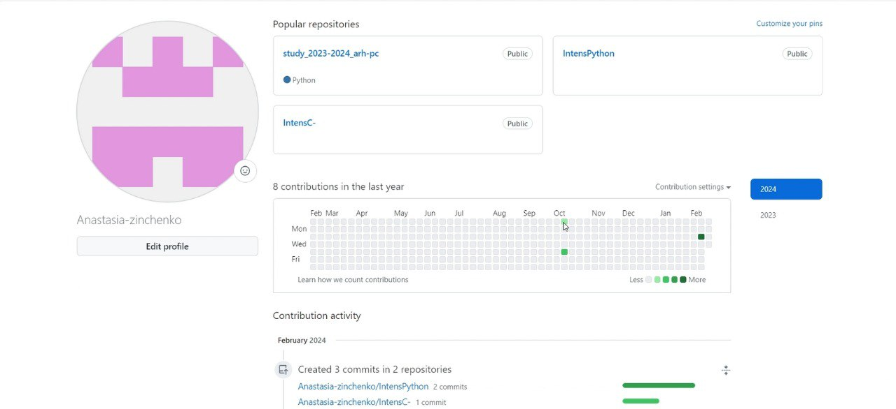{#fig:011 width=70%}

Вывела список ключей и скопировала отпечаток приватного ключа с помощью команды gpg --list-secret-keys --keyid-format LONG (рис. [-@fig:012]).

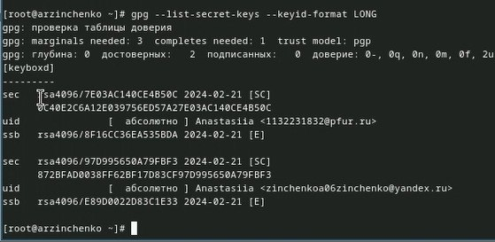{#fig:012 width=70%}

Cкопировала сгенерированный PGP ключ в буфер обмена с помощью команды gpg --armor --export <PGP Fingerprint> | xclip -sel clip. Перешла в настройки GitHub, нажала на кнопку New GPG key и вставила полученный ключ в поле ввода (рис. [-@fig:013]).

{#fig:013 width=70%}

Используя zinchenkoa06zinchenko@yandex.ru, указала Git применять его при подписи коммитов с помощью команд
    git config --global user.signingkey <PGP Fingerprint>
    git config --global commit.gpgsign true
    git config --global gpg.program $(which gpg2) (рис. [-@fig:014]).
    
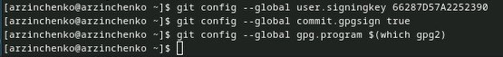{#fig:014 width=70%}

Я авторизовалась с помощью команды gh auth login (рис. [-@fig:015]).

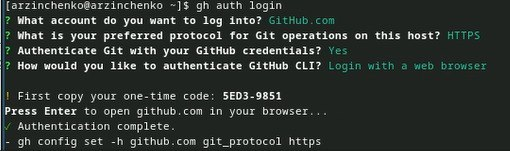{#fig:015 width=70%}

Я создала репозиторий с помощью команд 
    mkdir -p ~/work/study/2022-2023/"Операционные системы"
    cd ~/work/study/2022-2023/"Операционные системы"
    gh repo create study_2022-2023_os-intro --template=yamadharma/course-directory-student-template --public
    git clone --recursive git@github.com:<owner>/study_2022-2023_os-intro.git os-intro (рис. [-@fig:016]).
    
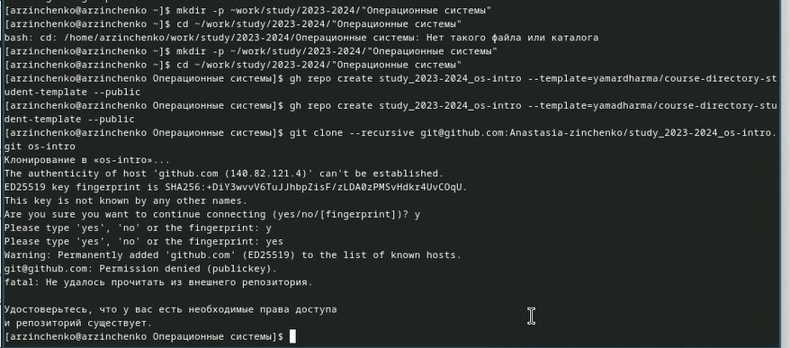{#fig:016 width=70%}

Для того чтобы насторить каталог курса я перешла в каталог курса с помощью команды cd ~/work/study/2022-2023/"Операционные системы"/os-intro (рис. [-@fig:017]).

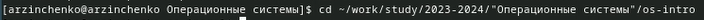{#fig:017 width=70%}

Удалила лишние файлы с помощью команды rm package.json (рис. [-@fig:018]).

{#fig:018 width=70%}

Создала необходимые каталоги с помощью команд
  echo os-intro > COURSE
  make (рис. [-@fig:019]).
  
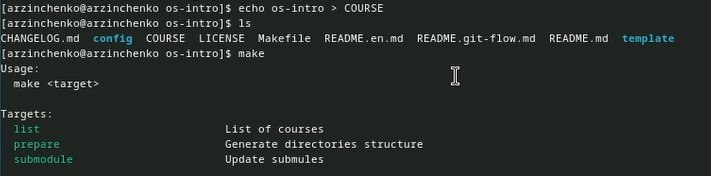{#fig:019 width=70%}

Отправила файлы на сервер с помощью команд 
 git add .
 git commit -am 'feat(main): make course structure'
 git push (рис. [-@fig:020]).
 
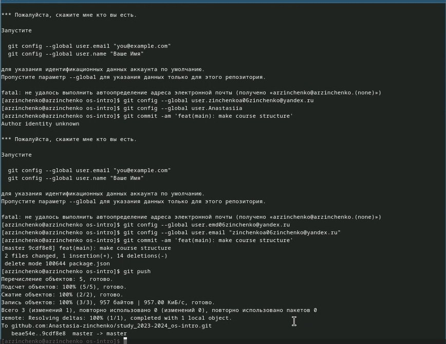{#fig:020 width=70%} 

Проверка файлов на сервере (рис. [-@fig:021]).

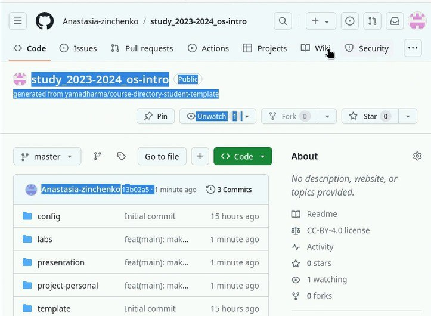{#fig:021 width=70%} 

Контрольные вопросы

1. Что такое системы контроля версий (VCS) и для решения каких задач они предназначаются? Это програмное обеспечение для облегчения работы с информацией, которая изменяется. Они позволяют хранить несколько версий одного и того же документа, при необходимости возвращаться к более ранним версиям, а также определять кто и когда сделал какие - либо изменения.
2. Объясните следующие понятия VCS и их отношения: хранилище, commit, история, рабочая копия. Хранилище -место хранения всех версий и служебной информации. Сommit - процесс создания новой версии. История -место, где сохранаются все коммиты, по которым можно посмотреть данные о коммитах. Рабочая копия - текущее состояние файлов проекта, основанное на версии, загруженной из хранилища.
3. Что представляют собой и чем отличаются централизованные и децентрализованные VCS? Приведите примеры VCS каждого вида. Централизованные VCS: одно основное хранилище всего проекта и каждый пользователь копирует себе необходимые ему файлы из этого репозитория, изменяет, а затем добавляет свои изменения обратно. Децентрализованные VCS: у каждого пользователя свой вариант репозитория.
4. Опишите действия с VCS при единоличной работе с хранилищем.
5. Опишите порядок работы с общим хранилищем VCS.
6. Каковы основные задачи, решаемые инструментальным средством git? 1. Хранение информации о всех изменениях в коде. 2. Обеспечение удобства работы над проектом в команде.
7. Назовите и дайте краткую характеристику командам git. 1. git-version (проверка версии Git). 2. git init - инициализация текущего рабочего каталога как Git репозиторий. 3. git clone - копирование существующего удаленного Git - репозитория. 4. git remote - просмотр списка текущих удаленных репозиториев. 5. git commit -am "Commit message" - сжимание всех индексированных файлов и отправка коммитов. 6. git branch - просмотр списка текущих веток. 
8. Приведите примеры использования при работе с локальным и удалённым репозиториями.
9. Что такое и зачем могут быть нужны ветви (branches)? Ветви нужны для того, чтобы программисты могли одновременно работать над одним и тем же файлом, не мешая друг другу.
10. Как и зачем можно игнорировать некоторые файлы при commit? Игнорируемы файлы - артефакты сборки и файлы, генерируемые машиной из исходных файлв в репозитории, либо файлы, которые не должны попадать в коммиты.

# Выводы

Я изучила идеологию и применение средств контроля версий и освоила умения по работе с git.

# Список литературы{.unnumbered}

::: {#refs}
:::
