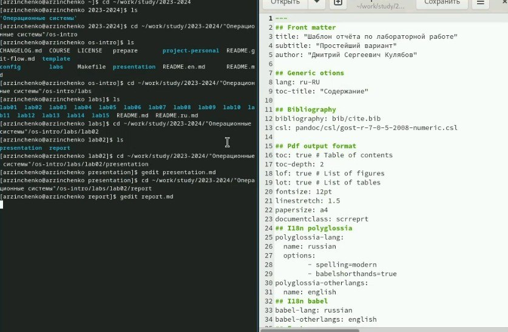
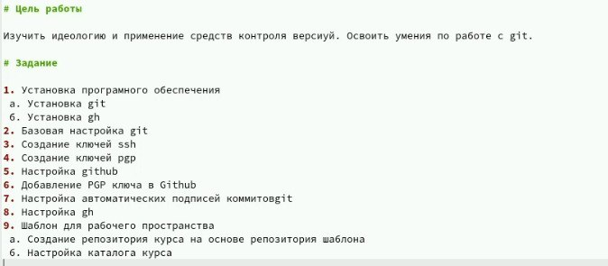
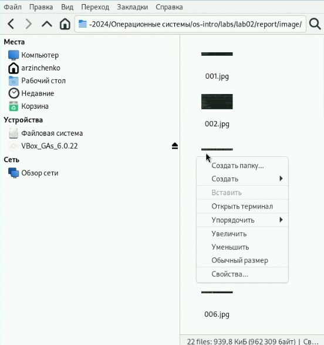
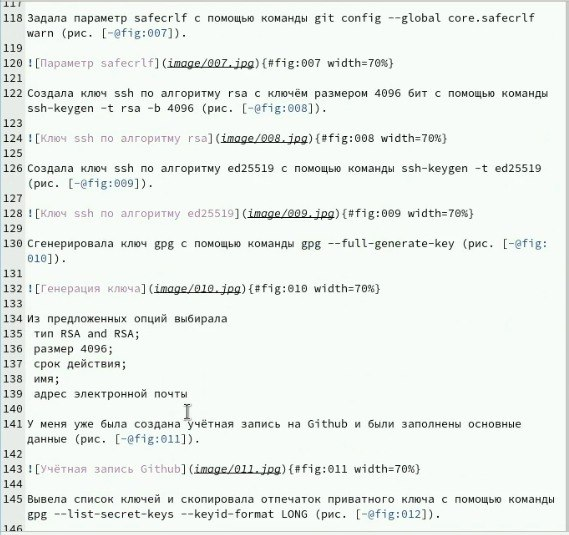
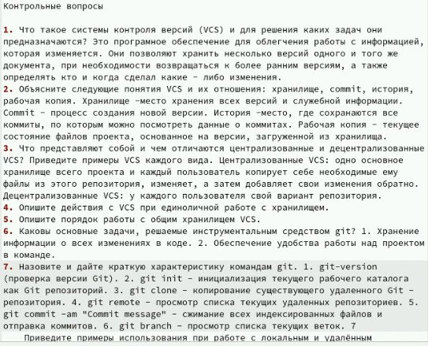
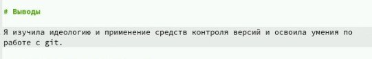
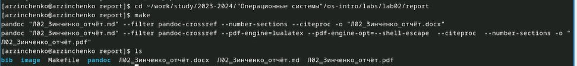

---
## Front matter
lang: ru-RU
title: Презентация
subtitle: по лабораторной работе № 3
author:
  - Зинченко А.Р
institute:
  - Российский университет дружбы народов, Москва, Россия
  - НБИбд-01-23
date: 02 марта 2024

## i18n babel
babel-lang: russian
babel-otherlangs: english

## Formatting pdf
toc: false
toc-title: Содержание
slide_level: 2
aspectratio: 169
section-titles: true
theme: metropolis
header-includes:
 - \metroset{progressbar=frametitle,sectionpage=progressbar,numbering=fraction}
 - '\makeatletter'
 - '\beamer@ignorenonframefalse'
 - '\makeatother'
---

# Информация

## Докладчик

  * Зинченко Анастасия Романовна 
  * Студентка НБИбд-01-23
  * Российский университет дружбы народов
  * [1132231832@pfur.ru]

:::

# Цель работы

Научиться оформлять отчёты с помощью легковесного языка разметки Markdown

# Задание

Сделать отчёт по предыдущей лабораторной работе в формате Markdown

# Выполнение лабораторной работы

Я перешла в каталог cd ~/work/study/2023-2024/"Операционные системы"/os-intro/labs/lab02/report и с помощью текстового редактора gedit открыла шаблон отчёта в Markdown.

{#fig:001 width=50%}

Я написала цель и задания.

{#fig:002 width=50%}

## Выполнение лабораторной работы

Переместила все фотографии в папку image.

{#fig:003 width=50%}

## Выполнение лабораторной работы

Оформила отчёт по лабораторной работе № 2.

{#fig:004 width=50%}

## Выполнение лабораторной работы

Ответила на контрольныпе вопросы.

{#fig:005 width=50%}

## Выполнение лабораторной работы

Подвела итоги.

{#fig:006 width=50%}

## Выполнение лабораторной работы

И с помощью команды make скомпилировала отчёт в pdf и doc.

{#fig:007 width=50%}

# Выводы

Я научилась оформлять отчёты с помощью легковесного языка разметки Markdown

