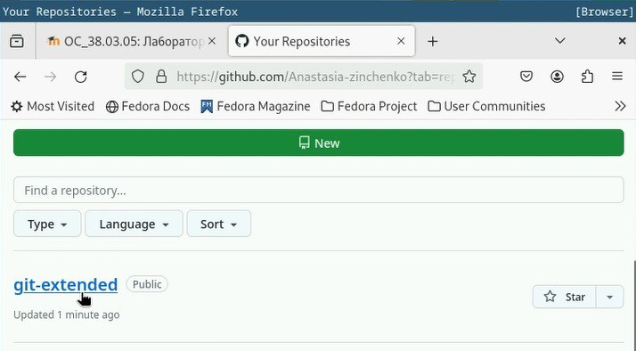
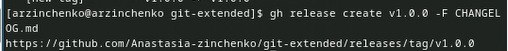

---
## Front matter
title: "Отчёт по лабораторной работе № 4"
subtitle: "Операционные системы"
author: "Анастасия Романовна Зинченко"

## Generic otions
lang: ru-RU
toc-title: "Содержание"

## Bibliography
bibliography: bib/cite.bib
csl: pandoc/csl/gost-r-7-0-5-2008-numeric.csl

## Pdf output format
toc: true # Table of contents
toc-depth: 2
lof: true # List of figures
lot: true # List of tables
fontsize: 12pt
linestretch: 1.5
papersize: a4
documentclass: scrreprt
## I18n polyglossia
polyglossia-lang:
  name: russian
  options:
	- spelling=modern
	- babelshorthands=true
polyglossia-otherlangs:
  name: english
## I18n babel
babel-lang: russian
babel-otherlangs: english
## Fonts
mainfont: PT Serif
romanfont: PT Serif
sansfont: PT Sans
monofont: PT Mono
mainfontoptions: Ligatures=TeX
romanfontoptions: Ligatures=TeX
sansfontoptions: Ligatures=TeX,Scale=MatchLowercase
monofontoptions: Scale=MatchLowercase,Scale=0.9
## Biblatex
biblatex: true
biblio-style: "gost-numeric"
biblatexoptions:
  - parentracker=true
  - backend=biber
  - hyperref=auto
  - language=auto
  - autolang=other*
  - citestyle=gost-numeric
## Pandoc-crossref LaTeX customization
figureTitle: "Рис."
tableTitle: "Таблица"
listingTitle: "Листинг"
lofTitle: "Список иллюстраций"
lotTitle: "Список таблиц"
lolTitle: "Листинги"
## Misc options
indent: true
header-includes:
  - \usepackage{indentfirst}
  - \usepackage{float} # keep figures where there are in the text
  - \floatplacement{figure}{H} # keep figures where there are in the text
---

# Цель работы

Получить навыки правильной раюоты с репозиториями git

# Задание

1. Установка программного обеспечения
2. Установка git-flow
3. Установка Node.js
4. Настройка Node.js
5. Общепринятые коммиты

# Выполнение лабораторной работы

Установка из коллекции репозиториев Copr (https://copr.fedorainfracloud.org/coprs/elegos/gitflow/) # Enable the copr repository dnf copr enable elegos/gitflow # Install gitflow dnf install gitflow
           
Установила nodejs и pnpm, с помощью команд dnf install nodejs и dnf install pnpm (рис. [-@fig:001]).

{#fig:001 width=70%}

Запустила pnpm setup (рис. [-@fig:002]).

{#fig:002 width=70%}

Выполнила source ~/.bashrc (рис. [-@fig:003]).

{#fig:003 width=70%}

Сформатировала коммиты с помощью команды рnpm add -g commitizen (рис. [-@fig:004]).

{#fig:004 width=70%}

Далее я ввела команду standard-changelog (рис. [-@fig:005]).

{#fig:005 width=70%}

Cоздала логи с помощью команды pnpm add -g standard-changelog

Создала репозиторий на GitHub и назвала его git-extended (рис. [-@fig:006]).

{#fig:006 width=70%}

Сделала первый коммит и выложила его на github с помощью команд git commit -m "first commit" git remote add origin git@github.com:/git-extended.git
git push -u origin master (рис. [-@fig:007]).

{#fig:007 width=70%}

Изменила файл package.json (рис. [-@fig:008]).

{#fig:008 width=70%}

Добавила новые файлы с помощью команды git add . (рис. [-@fig:009]).

{#fig:009 width=70%}

Выполнила коммит с помощью команды git cz (рис. [-@fig:010]).

{#fig:010 width=70%}

Отправила на github с помощью команды git push

Инициализировала git-flow с помощью команды git flow init (рис. [-@fig:011]).

{#fig:011 width=70%}

Проверила, что я на ветке develop с помощью команды git branch (рис. [-@fig:012]).

{#fig:012 width=70%}

Загрузила весь репозиторий в хранилище с помощью команды git push --all (рис. [-@fig:013]).

{#fig:013 width=70%}

Установила внешнюю ветку как вышестоящую для этой ветки с помощью команды git branch --set-upstream-to=origin/develop develop (рис. [-@fig:014]).

{#fig:014 width=70%}

Создала релиз с версией 1.0.0 с помощью команды git flow release start 1.0.0 (рис. [-@fig:015]).

{#fig:015 width=70%}

Создала журнал изменений с помощью команды standard-changelog --first-release (рис. [-@fig:016]).

{#fig:016 width=70%}

Добавила журнал изменений в индекс с помощью команд git add CHANGELOG.md и git commit -am 'chore(site): add changelog' (рис. [-@fig:017]).

{#fig:017 width=70%}

Залила релизную ветку в основную ветку с помощью команды git flow release finish 1.0.0 (рис. [-@fig:018]).

{#fig:018 width=70%}

Отправила данные на github с помощью команд git push --all и git push --tags (рис. [-@fig:019).

{#fig:019 width=70%}

Создала релиз на github. Для этого использовала утилиты работы с github: gh release create v1.0.0 -F CHANGELOG.md (рис. [-@fig:020]).

{#fig:020 width=70%}

Создала ветку для новой функциональности с помощью команды git flow feature start feature_branch (рис. [-@fig:021]).

{#fig:021 width=70%}

Объединила ветку feature_branch c develop с помощью команды git flow feature finish feature_branch (рис. [-@fig:022]).

{#fig:022 width=70%}

Создала релиз с версией 1.2.3 с помощью команды git flow release start 1.2.3 (рис. [-@fig:023]).

{#fig:023 width=70%}

Обновила номер версии в файле package.json. Установила её в 1.2.3. 

Создадала журнал изменений с помощью команды standard-changelog (рис. [-@fig:024]).

{#fig:024 width=70%}

Добавила журнал изменений в индекс с помощью команд git add CHANGELOG.md git commit -am 'chore(site): update changelog' (рис. [-@fig:025]).

{#fig:025 width=70%}

Залила релизную ветку в основную ветку с помощью команды git flow release finish 1.2.3 (рис. [-@fig:026]).

{#fig:026 width=70%}

Отправила данные на github с помощью команд git push --all git push --tags (рис. [-@fig:027]).

{#fig:027 width=70%}

Создадала релиз на github с комментарием из журнала изменений с помощью команды gh release create v1.2.3 -F CHANGELOG.md (рис. [-@fig:028]).

{#fig:028 width=70%}

# Выводы

Я получила навыки правильной работы с репозиториями git

# Список литературы{.unnumbered}

::: {#refs}
:::
