---
## Front matter
lang: ru-RU
title: Презентация
subtitle: по лабораторной работе № 5
  - Зинченко А.Р
institute:
  - Российский университет дружбы народов, Москва, Россия
date: 15 марта 2024

## i18n babel
babel-lang: russian
babel-otherlangs: english

## Formatting pdf
toc: false
toc-title: Содержание
slide_level: 2
aspectratio: 169
section-titles: true
theme: metropolis
header-includes:
 - \metroset{progressbar=frametitle,sectionpage=progressbar,numbering=fraction}
 - '\makeatletter'
 - '\beamer@ignorenonframefalse'
 - '\makeatother'
---

# Информация

## Докладчик

  * Зинченко Анастасия Романовна 
  * НБИбд-01-23
  * Российский университет дружбы народов
  
# Выполнение лабораторной работы

Установила менеджер паролей pass (рис. [-@fig:001]).

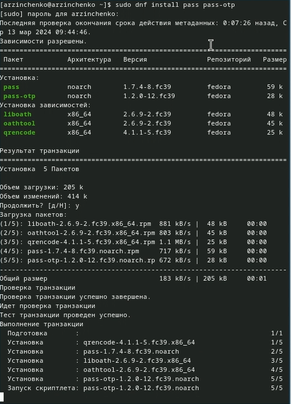{#fig:001 width=50%}

Установила gopass (рис. [-@fig:002]).

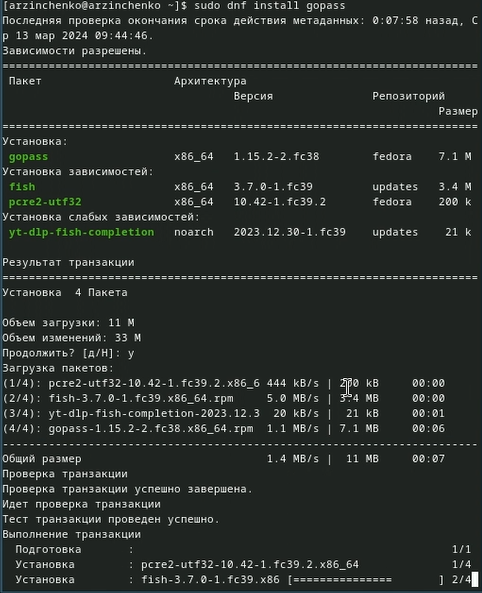{#fig:002 width=50%}

## Выполнение лабораторной работы

Просмотрела список ключей с помощью команды gpg --list-secret-keys (рис. [-@fig:003]).

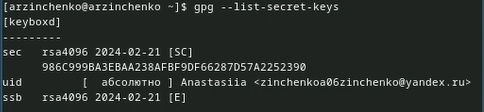{#fig:003 width=50%}

Произвела инициализацию хранилища с помощью команды pass init zinchenkoa06zinchenko@yandex.ru (рис. [-@fig:004]).

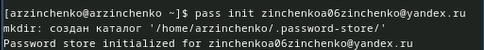{#fig:004 width=50%}

## Выполнение лабораторной работы

Создала структуру git с помощью команды pass git init (рис. [-@fig:005]).

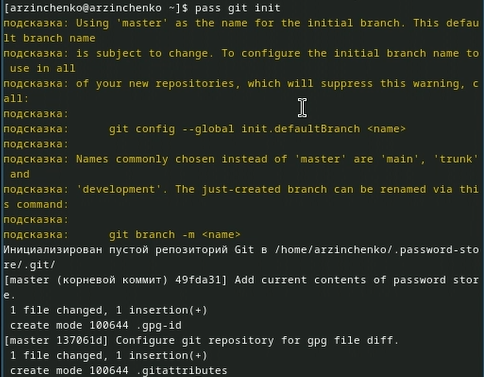{#fig:005 width=50%}

Создала репозиторий и назвала его adress. Задала адрес репозитория на хостинге с помощью команды pass git remote add origin git@github.com:<git_username>/<git_repo>.git (рис. [-@fig:006]).

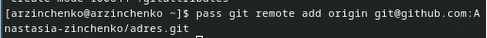{#fig:006 width=50%}

## Выполнение лабораторной работы

Синхронизировала с помощью команд pass git pull и pass git push (рис. [-@fig:007]).

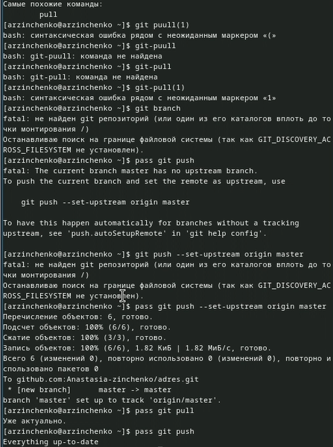{#fig:007 width=50%}
 
Закоммитила и выложила изменения с помощью команд cd ~/.password-store/
git add .
git commit -am 'edit manually'
git push (рис. [-@fig:008]).

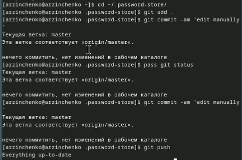

## Выполнение лабораторной работы

Проверила статус синхронизации с помощью команды pass git status (рис. [-@fig:009]).

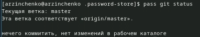{#fig:098 width=50%}

Произвела 2 установки с помощью команд dnf copr enable maximbaz/browserpass (рис. [-@fig:010]).

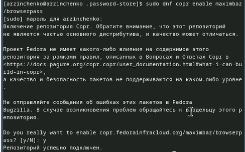{#fig:010 width=50%}

## Выполнение лабораторной работы
            
dnf install browserpass (рис. [-@fig:011]).

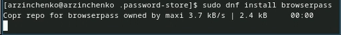{#fig:011 width=50%}

Добавила новый пароль с помощью команды pass insert file.txt (рис. [-@fig:012]).

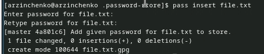{#fig:012 width=50%}

## Выполнение лабораторной работы

Отобразила пароль для file.txt c помощью команды pass file.txt (рис. [-@fig:013]).

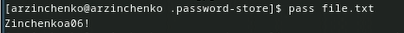{#fig:013 width=50%}

Заменила существующий пароль с помощью команды pass generate --in-place file.txt (рис. [-@fig:014]).

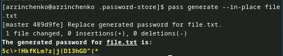{#fig:014 width=50%}

## Выполнение лабораторной работы

Установила дополнительное программное обеспечение с помощью команд 
    sudo dnf -y install \
       dunst \
       fontawesome-fonts \
       powerline-fonts \
       light \
       fuzzel \
       swaylock \
       kitty \
       waybar swaybg \
       wl-clipboard \
       mpv \
       grim \
       slurp (рис. [-@fig:015]).

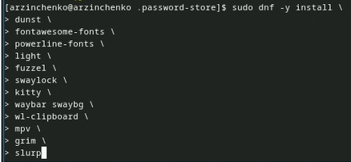{#fig:015 width=50%}

Установила шрифты с помощью команд sudo dnf copr enable peterwu/iosevka (рис. [-@fig:016]).

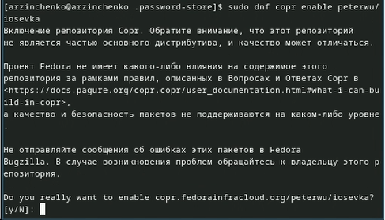{#fig:016 width=50%}

## Выполнение лабораторной работы
    
sudo dnf search iosevka (рис. [-@fig:017]).

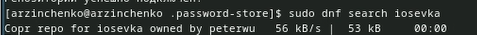{#fig:017 width=50%}
    
sudo dnf install iosevka-fonts iosevka-aile-fonts iosevka-curly-fonts iosevka-slab-fonts iosevka-etoile-fonts iosevka-term-fonts (рис. [-@fig:018]).

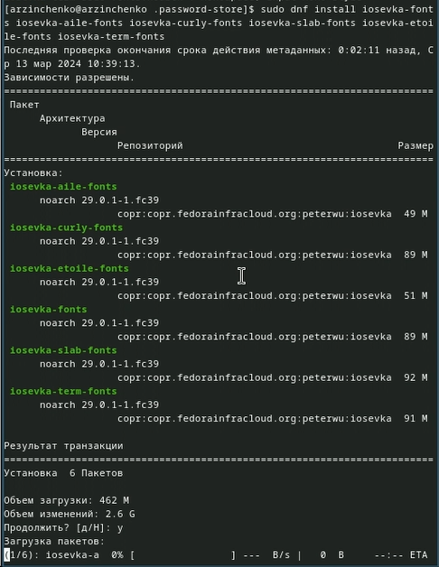{#fig:018 width=50%}

