---
## Front matter
title: "Отчёт по лабораторной работе № 5"
subtitle: "Операционные системы"
author: "Анастасия Романовна Зинченко"

## Generic otions
lang: ru-RU
toc-title: "Содержание"

## Bibliography
bibliography: bib/cite.bib
csl: pandoc/csl/gost-r-7-0-5-2008-numeric.csl

## Pdf output format
toc: true # Table of contents
toc-depth: 2
lof: true # List of figures
lot: true # List of tables
fontsize: 12pt
linestretch: 1.5
papersize: a4
documentclass: scrreprt
## I18n polyglossia
polyglossia-lang:
  name: russian
  options:
	- spelling=modern
	- babelshorthands=true
polyglossia-otherlangs:
  name: english
## I18n babel
babel-lang: russian
babel-otherlangs: english
## Fonts
mainfont: PT Serif
romanfont: PT Serif
sansfont: PT Sans
monofont: PT Mono
mainfontoptions: Ligatures=TeX
romanfontoptions: Ligatures=TeX
sansfontoptions: Ligatures=TeX,Scale=MatchLowercase
monofontoptions: Scale=MatchLowercase,Scale=0.9
## Biblatex
biblatex: true
biblio-style: "gost-numeric"
biblatexoptions:
  - parentracker=true
  - backend=biber
  - hyperref=auto
  - language=auto
  - autolang=other*
  - citestyle=gost-numeric
## Pandoc-crossref LaTeX customization
figureTitle: "Рис."
tableTitle: "Таблица"
listingTitle: "Листинг"
lofTitle: "Список иллюстраций"
lotTitle: "Список таблиц"
lolTitle: "Листинги"
## Misc options
indent: true
header-includes:
  - \usepackage{indentfirst}
  - \usepackage{float} # keep figures where there are in the text
  - \floatplacement{figure}{H} # keep figures where there are in the text
---

# Задание

1. Менеджер паролей pass
 1.1. Установка
 1.2. Настройка
 1.3. Настройка интерфейса с броузером
 1.4. Сохранение пароля
2. Управление файлами конфигурации

# Выполнение лабораторной работы

Установила менеджер паролей pass (рис. [-@fig:001]).

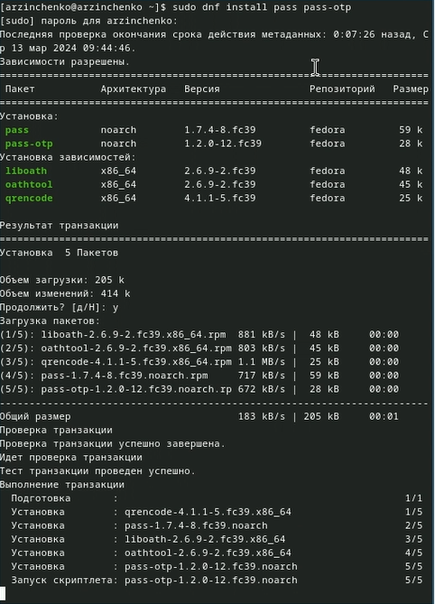{#fig:001 width=70%}

Установила gopass (рис. [-@fig:002]).

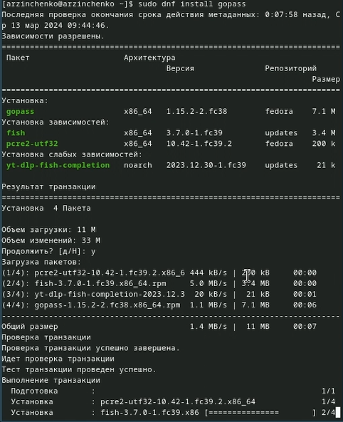{#fig:002 width=70%}

Просмотрела список ключей с помощью команды gpg --list-secret-keys (рис. [-@fig:003]).

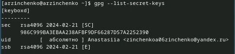{#fig:003 width=70%}

Произвела инициализацию хранилища с помощью команды pass init zinchenkoa06zinchenko@yandex.ru (рис. [-@fig:004]).

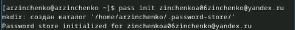{#fig:004 width=70%}

Создала структуру git с помощью команды pass git init (рис. [-@fig:005]).

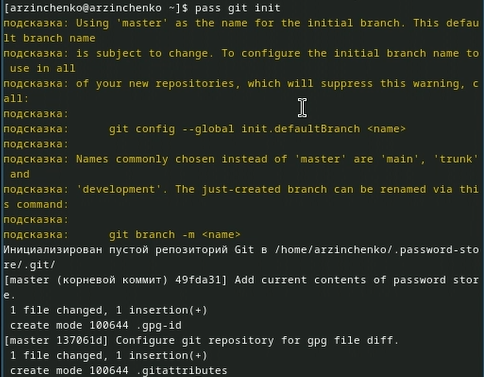{#fig:005 width=70%}

Создала репозиторий и назвала его adress. Задала адрес репозитория на хостинге с помощью команды pass git remote add origin git@github.com:<git_username>/<git_repo>.git (рис. [-@fig:006]).

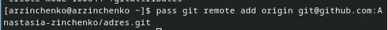{#fig:006 width=70%}

Синхронизировала с помощью команд pass git pull и pass git push (рис. [-@fig:007]).

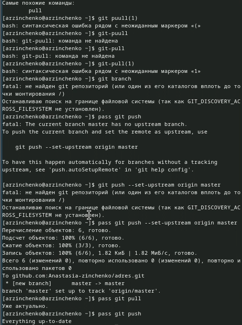{#fig:007 width=70%}
 
Закоммитила и выложила изменения с помощью команд cd ~/.password-store/
git add .
git commit -am 'edit manually'
git push (рис. [-@fig:008]).

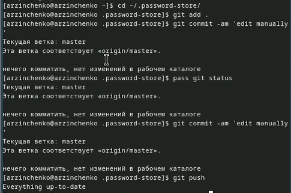

Проверила статус синхронизации с помощью команды pass git status (рис. [-@fig:009]).

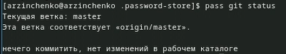{#fig:098 width=70%}

Произвела 2 установки с помощью команд dnf copr enable maximbaz/browserpass (рис. [-@fig:010]).

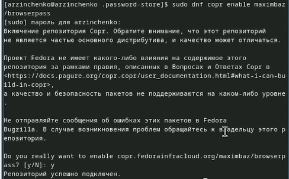{#fig:010 width=70%}
            
dnf install browserpass (рис. [-@fig:011]).

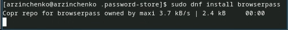{#fig:011 width=70%}

Добавила новый пароль с помощью команды pass insert file.txt (рис. [-@fig:012]).

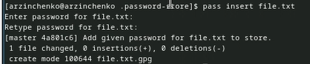{#fig:012 width=70%}

Отобразила пароль для file.txt c помощью команды pass file.txt (рис. [-@fig:013]).

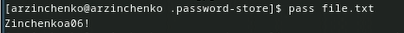{#fig:013 width=70%}

Заменила существующий пароль с помощью команды pass generate --in-place file.txt (рис. [-@fig:014]).

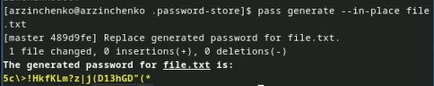{#fig:014 width=70%}

Установила дополнительное программное обеспечение с помощью команд 
    sudo dnf -y install \
       dunst \
       fontawesome-fonts \
       powerline-fonts \
       light \
       fuzzel \
       swaylock \
       kitty \
       waybar swaybg \
       wl-clipboard \
       mpv \
       grim \
       slurp (рис. [-@fig:015]).

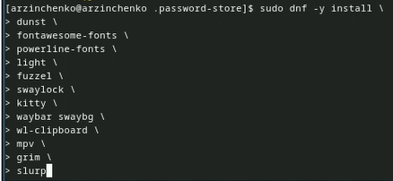{#fig:015 width=70%}

Установила шрифты с помощью команд sudo dnf copr enable peterwu/iosevka (рис. [-@fig:016]).

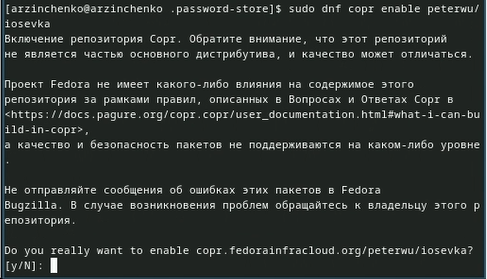{#fig:016 width=70%}
    
sudo dnf search iosevka (рис. [-@fig:017]).

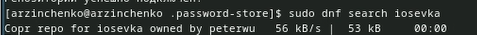{#fig:017 width=70%}
    
sudo dnf install iosevka-fonts iosevka-aile-fonts iosevka-curly-fonts iosevka-slab-fonts iosevka-etoile-fonts iosevka-term-fonts (рис. [-@fig:018]).

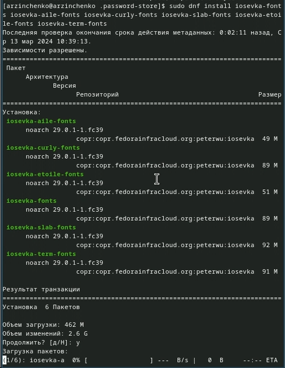{#fig:018 width=70%}

# Список литературы{.unnumbered}

::: {#refs}
:::
