---
## Front matter
lang: ru-RU
title: Презентация
subtitle: лабораторной работы № 6
author:
  - Зинченко А.Р
institute:
  - Российский университет дружбы народов, Москва, Россия
date: 16 марта 2024

## i18n babel
babel-lang: russian
babel-otherlangs: english

## Formatting pdf
toc: false
toc-title: Содержание
slide_level: 2
aspectratio: 169
section-titles: true
theme: metropolis
header-includes:
 - \metroset{progressbar=frametitle,sectionpage=progressbar,numbering=fraction}
 - '\makeatletter'
 - '\beamer@ignorenonframefalse'
 - '\makeatother'
---

# Информация

## Докладчик

  * Зинченко Анастасия Романовна
  * Студентка НБИбд01-23
  * Российский университет дружбы народов

# Цель работы

Приобрести практические навыки взаимодействия пользователя с системой посредством командной строки

# Задание

1. Определите полное имя вашего домашнего каталога. Далее относительно этого ката-
лога будут выполняться последующие упражнения.
2. Выполните следующие действия:
2.1. Перейдите в каталог /tmp.
2.2. Выведите на экран содержимое каталога /tmp. Для этого используйте команду ls
с различными опциями. Поясните разницу в выводимой на экран информации.
2.3. Определите, есть ли в каталоге /var/spool подкаталог с именем cron?
2.4. Перейдите в Ваш домашний каталог и выведите на экран его содержимое. Опре-
делите, кто является владельцем файлов и подкаталогов?
3. Выполните следующие действия:
3.1. В домашнем каталоге создайте новый каталог с именем newdir.
3.2. В каталоге ~/newdir создайте новый каталог с именем morefun.
3.3. В домашнем каталоге создайте одной командой три новых каталога с именами
letters, memos, misk. Затем удалите эти каталоги одной командой.
3.4. Попробуйте удалить ранее созданный каталог ~/newdir командой rm. Проверьте,
был ли каталог удалён.
3.5. Удалите каталог ~/newdir/morefun из домашнего каталога. Проверьте, был ли
каталог удалён.
4. С помощью команды man определите, какую опцию команды ls нужно использо-
вать для просмотра содержимое не только указанного каталога, но и подкаталогов,
входящих в него.
5. С помощью команды man определите набор опций команды ls, позволяющий отсорти-
ровать по времени последнего изменения выводимый список содержимого каталога
с развёрнутым описанием файлов.
6. Используйте команду man для просмотра описания следующих команд: cd, pwd, mkdir,
rmdir, rm. Поясните основные опции этих команд.
7. Используя информацию, полученную при помощи команды history, выполните мо-
дификацию и исполнение нескольких команд из буфера команд.

# Выполнение лабораторной работы

Определила полное имя своего домашнего каталога с помощью команды pwd  (рис. [-@fig:001]).

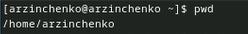{#fig:001 width=50%}

Перешла в каталог /tmp с помощью команды cd /tmp (рис. [-@fig:002]).

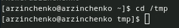{#fig:002 width=50%}

## Выполнение лабораторной работы

Вывела на экран содержимое каталога /tmp с помощью команды ls с различными опциями (рис. [-@fig:003]).

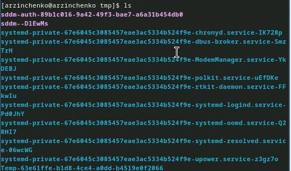{#fig:003 width=50%}

ls -l (рис. [-@fig:004]).

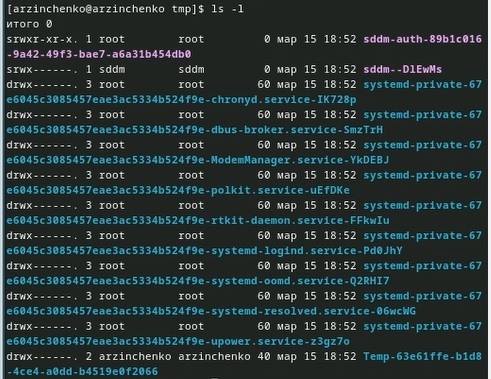{#fig:004 width=50%}

## Выполнение лабораторной работы

ls -a (рис. [-@fig:005]).

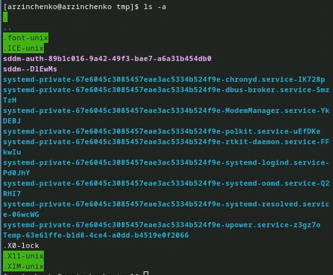{#fig:005 width=50%}

ls -f (рис. [-@fig:006]).

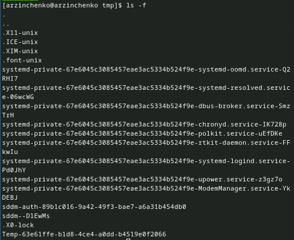{#fig:006 width=50%}

## Выполнение лабораторной работы

ls -alf (рис. [-@fig:007]).

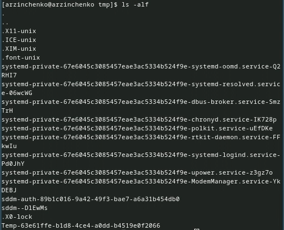{#fig:007 width=50%}

Определила, есть ли в каталоге /var/spool подкаталог с именем cron (есть) (рис. [-@fig:008]).

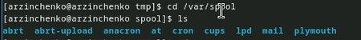{#fig:008 width=50%}

## Выполнение лабораторной работы

Перешла в свой домашний каталог и вывела на экран его содержимое (рис. [-@fig:009]).

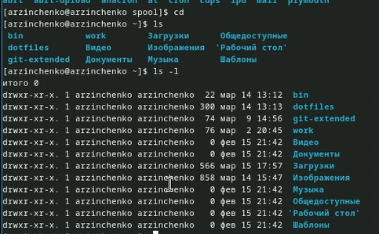{#fig:009 width=50%}

В домашнем каталоге создала новый каталог с именем newdir (рис. [-@fig:010]).

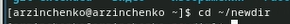{#fig:010 width=50%}

## Выполнение лабораторной работы

В каталоге ~/newdir создала новый каталог с именем morefun (рис. [-@fig:011]).

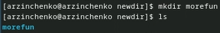{#fig:011 width=50%}

В домашнем каталоге создайла одной командой три новых каталога с именами letters, memos, misk (рис. [-@fig:012]).

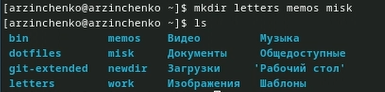{#fig:012 width=50%}

## Выполнение лабораторной работы

Затем удалила эти каталоги одной командой (рис. [-@fig:013]).

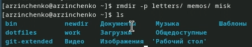{#fig:013 width=50%}

Попробуйте удалить ранее созданный каталог ~/newdir командой rm (не получилось) (рис. [-@fig:014]).

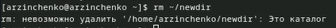{#fig:014 width=50%}

## Выполнение лабораторной работы

Удалила каталог ~/newdir/morefun из домашнего каталога. Проверила, был ли каталог удалён (рис. [-@fig:015]).

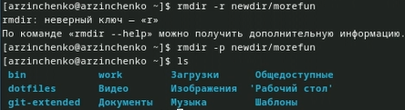{#fig:015 width=50%}

С помощью команды man определила, какую опцию команды ls нужно использовать для просмотра содержимого не только указанного каталога, но и подкаталогов,входящих в него (рис. [-@fig:016]).

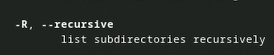{#fig:016 width=50%}

## Выполнение лабораторной работы

С помощью команды man определила набор опций команды ls, позволяющий отсортировать по времени последнего изменения выводимый список содержимого каталога (рис. [-@fig:017]).

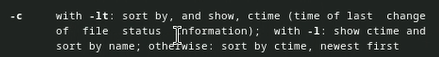{#fig:017 width=50%}

Использовала команду man для просмотра описания следующих команд: cd (рис. [-@fig:018]).

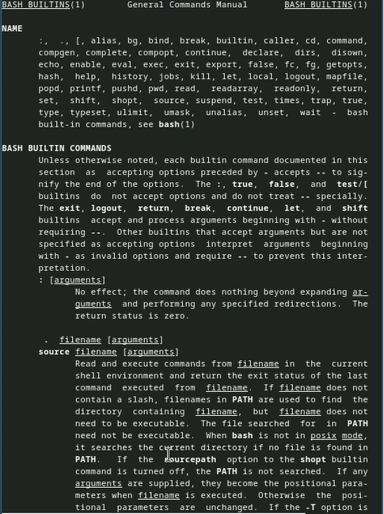{#fig:018 width=50%}

## Выполнение лабораторной работы

pwd (рис. [-@fig:019]).

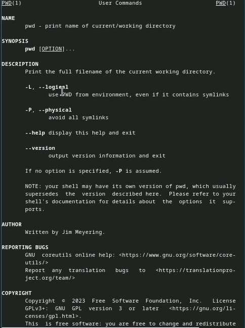{#fig:019 width=50%}

 mkdir (рис. [-@fig:020]).

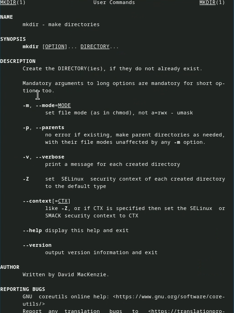{#fig:020 width=50%}

## Выполнение лабораторной работы

rmdir (рис. [-@fig:021]).

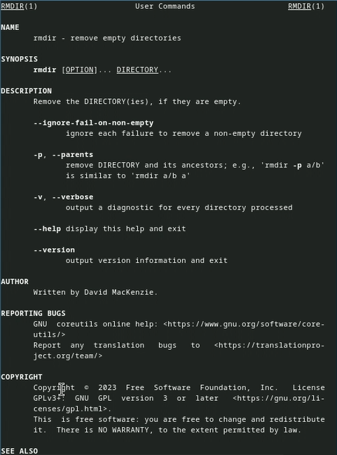{#fig:021 width=50%}

rm (рис. [-@fig:022]).

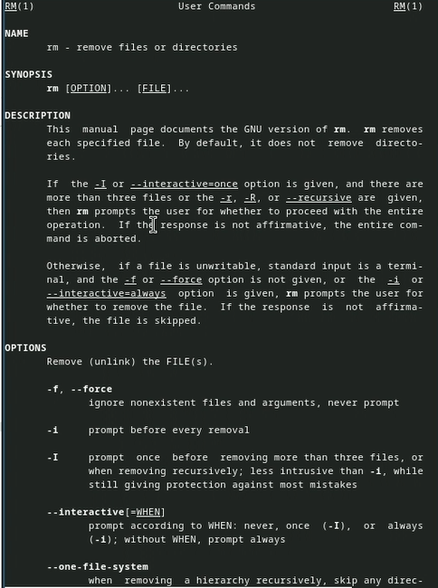{#fig:022 width=50%}

## Выполнение лабораторной работы

Используя информацию, полученную при помощи команды history, выполните модификацию и исполнение нескольких команд из буфера команд (рис. [-@fig:023]).

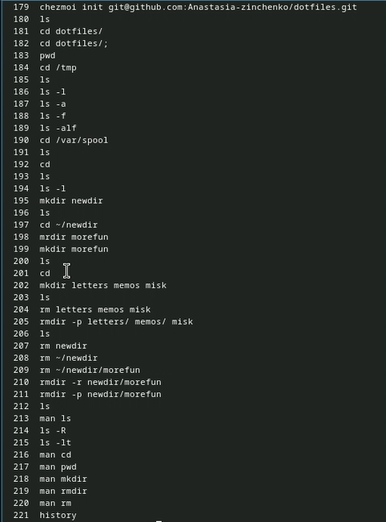{#fig:023 width=50%}

Модификация (рис. [-@fig:024]).

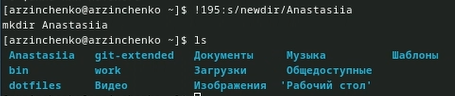{#fig:024 width=50%}

# Выводы

Я приобрела практические навыки взаимодействия пользователя с системой посредством командной строки

