---
## Front matter
title: "Отчёт по лабораторной работе № 6"
subtitle: "Операционные системы"
author: "Анастасия Романовна Зинченко"

## Generic otions
lang: ru-RU
toc-title: "Содержание"

## Bibliography
bibliography: bib/cite.bib
csl: pandoc/csl/gost-r-7-0-5-2008-numeric.csl

## Pdf output format
toc: true # Table of contents
toc-depth: 2
lof: true # List of figures
lot: true # List of tables
fontsize: 12pt
linestretch: 1.5
papersize: a4
documentclass: scrreprt
## I18n polyglossia
polyglossia-lang:
  name: russian
  options:
	- spelling=modern
	- babelshorthands=true
polyglossia-otherlangs:
  name: english
## I18n babel
babel-lang: russian
babel-otherlangs: english
## Fonts
mainfont: PT Serif
romanfont: PT Serif
sansfont: PT Sans
monofont: PT Mono
mainfontoptions: Ligatures=TeX
romanfontoptions: Ligatures=TeX
sansfontoptions: Ligatures=TeX,Scale=MatchLowercase
monofontoptions: Scale=MatchLowercase,Scale=0.9
## Biblatex
biblatex: true
biblio-style: "gost-numeric"
biblatexoptions:
  - parentracker=true
  - backend=biber
  - hyperref=auto
  - language=auto
  - autolang=other*
  - citestyle=gost-numeric
## Pandoc-crossref LaTeX customization
figureTitle: "Рис."
tableTitle: "Таблица"
listingTitle: "Листинг"
lofTitle: "Список иллюстраций"
lotTitle: "Список таблиц"
lolTitle: "Листинги"
## Misc options
indent: true
header-includes:
  - \usepackage{indentfirst}
  - \usepackage{float} # keep figures where there are in the text
  - \floatplacement{figure}{H} # keep figures where there are in the text
---

# Цель работы

Приобрести практические навыки взаимодействия пользователя с системой посредством командной строки

# Задание

1. Определите полное имя вашего домашнего каталога. Далее относительно этого ката-
лога будут выполняться последующие упражнения.
2. Выполните следующие действия:
2.1. Перейдите в каталог /tmp.
2.2. Выведите на экран содержимое каталога /tmp. Для этого используйте команду ls
с различными опциями. Поясните разницу в выводимой на экран информации.
2.3. Определите, есть ли в каталоге /var/spool подкаталог с именем cron?
2.4. Перейдите в Ваш домашний каталог и выведите на экран его содержимое. Опре-
делите, кто является владельцем файлов и подкаталогов?
3. Выполните следующие действия:
3.1. В домашнем каталоге создайте новый каталог с именем newdir.
3.2. В каталоге ~/newdir создайте новый каталог с именем morefun.
3.3. В домашнем каталоге создайте одной командой три новых каталога с именами
letters, memos, misk. Затем удалите эти каталоги одной командой.
3.4. Попробуйте удалить ранее созданный каталог ~/newdir командой rm. Проверьте,
был ли каталог удалён.
3.5. Удалите каталог ~/newdir/morefun из домашнего каталога. Проверьте, был ли
каталог удалён.
4. С помощью команды man определите, какую опцию команды ls нужно использо-
вать для просмотра содержимое не только указанного каталога, но и подкаталогов,
входящих в него.
5. С помощью команды man определите набор опций команды ls, позволяющий отсорти-
ровать по времени последнего изменения выводимый список содержимого каталога
с развёрнутым описанием файлов.
6. Используйте команду man для просмотра описания следующих команд: cd, pwd, mkdir,
rmdir, rm. Поясните основные опции этих команд.
7. Используя информацию, полученную при помощи команды history, выполните мо-
дификацию и исполнение нескольких команд из буфера команд.

# Выполнение лабораторной работы

Определила полное имя своего домашнего каталога с помощью команды pwd  (рис. [-@fig:001]).

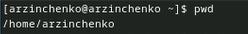{#fig:001 width=70%}

Перешла в каталог /tmp с помощью команды cd /tmp (рис. [-@fig:002]).

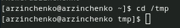{#fig:002 width=70%}

Вывела на экран содержимое каталога /tmp с помощью команды ls с различными опциями (рис. [-@fig:003]).

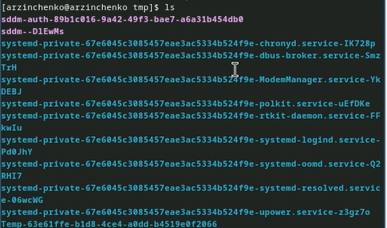{#fig:003 width=70%}

ls -l (рис. [-@fig:004]).

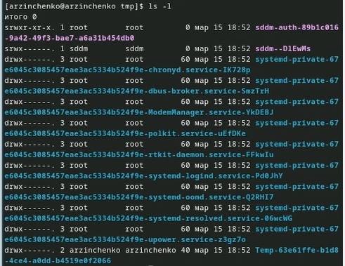{#fig:004 width=70%}

ls -a (рис. [-@fig:005]).

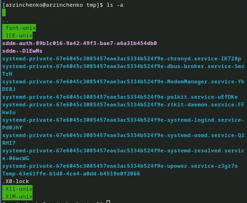{#fig:005 width=70%}

ls -f (рис. [-@fig:006]).

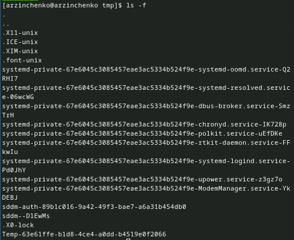{#fig:006 width=70%}

ls -alf (рис. [-@fig:007]).

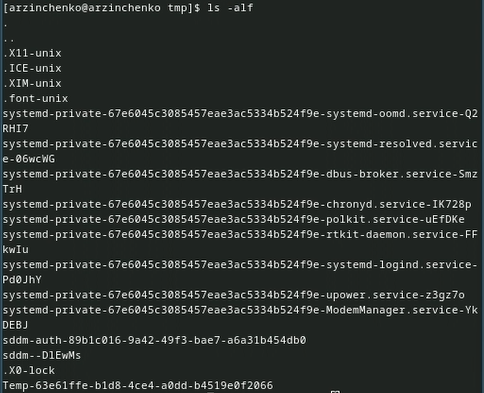{#fig:007 width=70%}

Определила, есть ли в каталоге /var/spool подкаталог с именем cron (есть) (рис. [-@fig:008]).

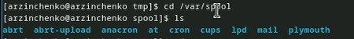{#fig:008 width=70%}

Перешла в свой домашний каталог и вывела на экран его содержимое (рис. [-@fig:009]).

{#fig:009 width=70%}

В домашнем каталоге создала новый каталог с именем newdir (рис. [-@fig:010]).

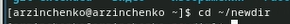{#fig:010 width=70%}

В каталоге ~/newdir создала новый каталог с именем morefun (рис. [-@fig:011]).

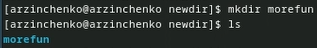{#fig:011 width=70%}

В домашнем каталоге создайла одной командой три новых каталога с именами letters, memos, misk (рис. [-@fig:012]).

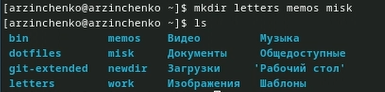{#fig:012 width=70%}

Затем удалила эти каталоги одной командой (рис. [-@fig:013]).

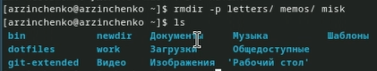{#fig:013 width=70%}

Попробуйте удалить ранее созданный каталог ~/newdir командой rm (не получилось) (рис. [-@fig:014]).

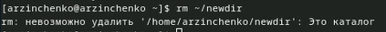{#fig:014 width=70%}

Удалила каталог ~/newdir/morefun из домашнего каталога. Проверила, был ли каталог удалён (рис. [-@fig:015]).

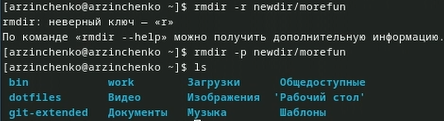{#fig:015 width=70%}

С помощью команды man определила, какую опцию команды ls нужно использовать для просмотра содержимого не только указанного каталога, но и подкаталогов,входящих в него (рис. [-@fig:016]).

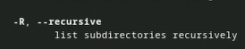{#fig:016 width=70%}

С помощью команды man определила набор опций команды ls, позволяющий отсортировать по времени последнего изменения выводимый список содержимого каталога (рис. [-@fig:017]).

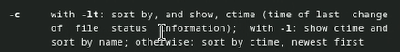{#fig:017 width=70%}

Использовала команду man для просмотра описания следующих команд: cd (рис. [-@fig:018]).

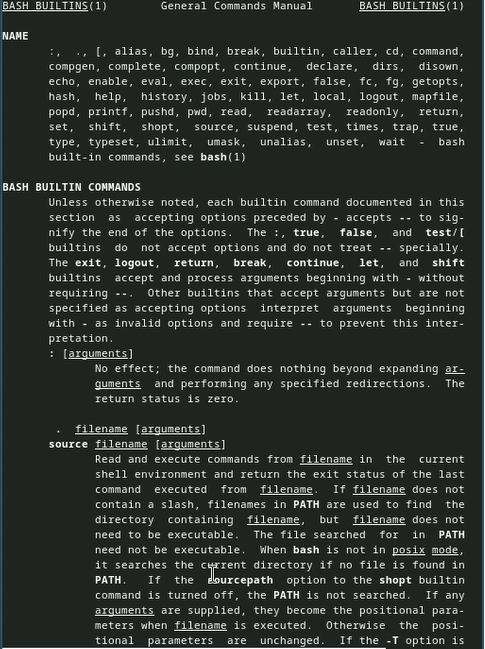{#fig:018 width=70%}

pwd (рис. [-@fig:019]).

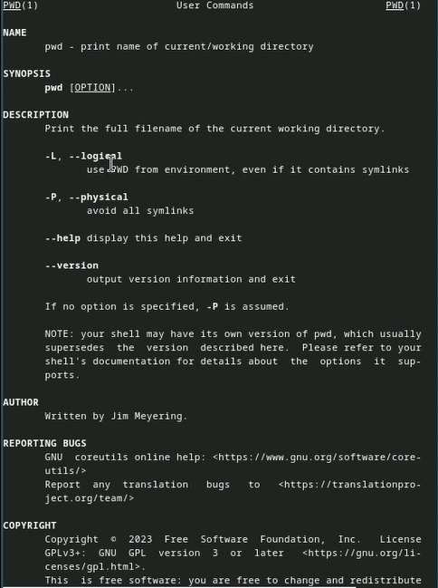{#fig:019 width=70%}

 mkdir (рис. [-@fig:020]).

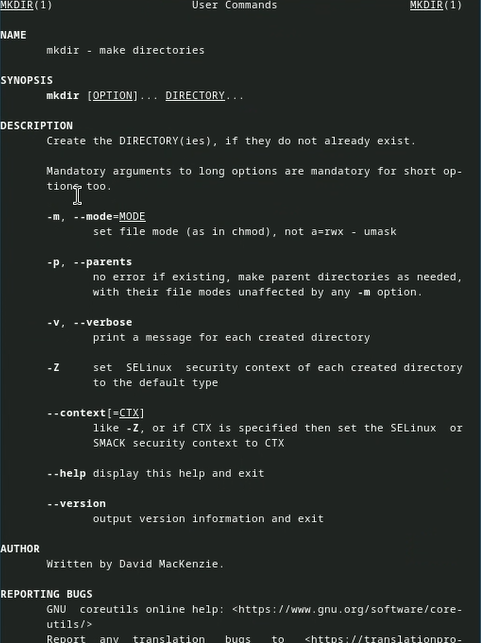{#fig:020 width=70%}

rmdir (рис. [-@fig:021]).

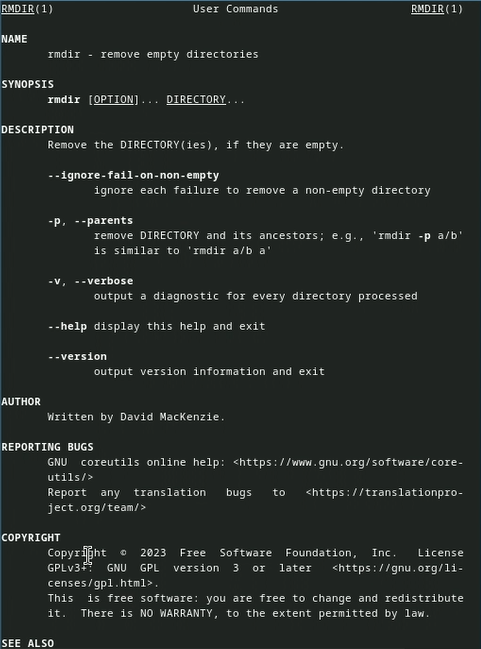{#fig:021 width=70%}

rm (рис. [-@fig:022]).

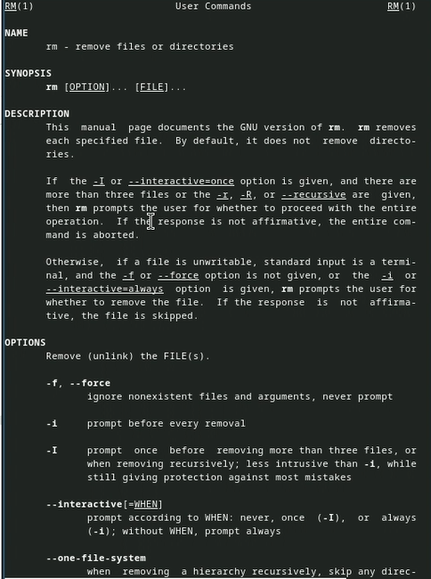{#fig:022 width=70%}

Используя информацию, полученную при помощи команды history, выполните модификацию и исполнение нескольких команд из буфера команд (рис. [-@fig:023]).

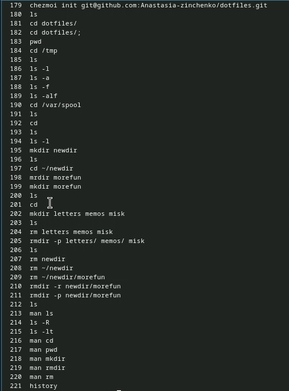{#fig:023 width=70%}

Модификация (рис. [-@fig:024]).

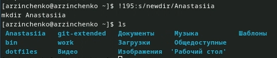{#fig:024 width=70%}

# Выводы

Здесь кратко описываются итоги проделанной работы.

# Список литературы{.unnumbered}

::: {#refs}
:::
