---
## Front matter
lang: ru-RU
title: Презентация
subtitle: по лабораторной работе № 7 
author:
  - Зинченко А.Р.
institute:
  - Российский университет дружбы народов, Москва, Россия
date: 23 матра 2024

## i18n babel
babel-lang: russian
babel-otherlangs: english

## Formatting pdf
toc: false
toc-title: Содержание
slide_level: 2
aspectratio: 169
section-titles: true
theme: metropolis
header-includes:
 - \metroset{progressbar=frametitle,sectionpage=progressbar,numbering=fraction}
 - '\makeatletter'
 - '\beamer@ignorenonframefalse'
 - '\makeatother'
---

# Информация

## Докладчик

  * Зинченко Анастасия Романовна
  * студентка НБИбд-01-23
  * Российский университет дружбы народов

# Цель работы

Ознакомиться с файловой системой Linux, её структурой, именами и содержанием
каталогов. Приобрести практические навыки по применению команд для работы с файлами и каталогами, по управлению процессами (и работами), по проверке использования диска и обслуживанию файловой системы

# Задание

1. Выполнить все примеры, приведённые в первой части описания лабораторной работы.
2. Выполнить следующие действия, зафиксировав в отчёте по лабораторной работе используемые при этом команды и результаты их выполнения
3. Определить опции команды chmod, необходимые для того, чтобы присвоить перечисленным ниже файлам выделенные права доступа, считая, что в начале таких прав нет
4. Проделать приведённые ниже упражнения, записывая в отчёт по лабораторной работе используемые при этом команды
5. Прочитать man по командам mount, fsck, mkfs, kill и кратко их охарактеризовать приведя примеры

# Выполнение лабораторной работы

Скопировала файл ~/abc1 в файл april и в файл may (рис. [-@fig:001]).

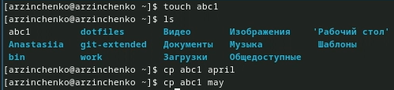{#fig:001 width=70%}

Скопировала файлы april и may в каталог monthly (рис. [-@fig:002]).

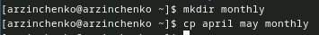{#fig:002 width=70%}

## Выполнение лабораторной работы

Скопировала файл monthly/may в файл с именем june (рис. [-@fig:003]).

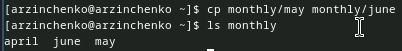{#fig:003 width=70%}

Скопировала каталог monthly в каталог monthly.00 (рис. [-@fig:004]).

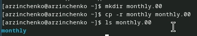{#fig:004 width=70%}

## Выполнение лабораторной работы

Скопировала каталог monthly.00 в каталог /tmp (рис. [-@fig:005]).

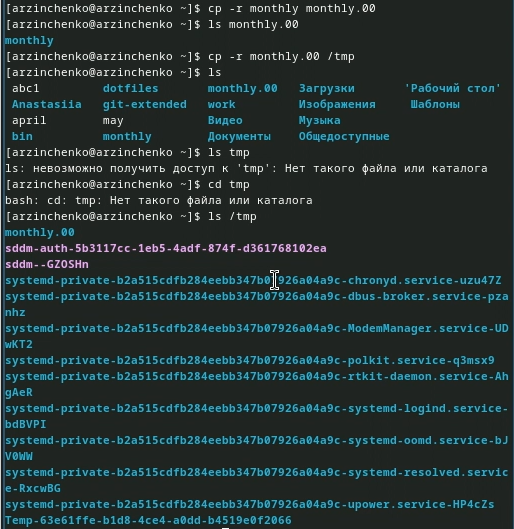{#fig:005 width=70%}

Изменила название файла april на july в домашнем каталоге (рис. [-@fig:006]).

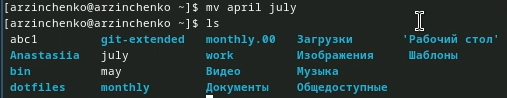{#fig:006 width=70%}

## Выполнение лабораторной работы

Переместила файл july в каталог monthly.00 (рис. [-@fig:007]).

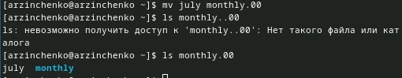{#fig:007 width=70%}

Переименовала каталог monthly.00 в monthly.01 (рис. [-@fig:008]).

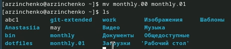{#fig:008 width=70%}

## Выполнение лабораторной работы

Переместила каталог monthly.01 в каталог reports (рис. [-@fig:009]).

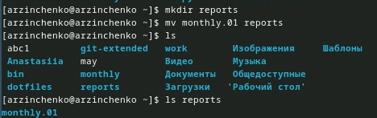{#fig:009 width=70%}

Переименовала каталог reports/monthly.01 в reports/monthly (рис. [-@fig:010]).

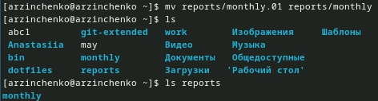{#fig:010 width=70%}

## Выполнение лабораторной работы

Создала файл ~/may с правом выполнения для владельца (рис. [-@fig:011]).

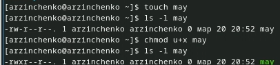{#fig:011 width=70%}

Лишила владельца файла ~/may права на выполнение (рис. [-@fig:012]).

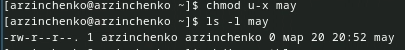{#fig:012 width=70%}

## Выполнение лабораторной работы

Создала каталог monthly с запретом на чтение для членов группы и всех
остальных пользователей (рис. [-@fig:013]).

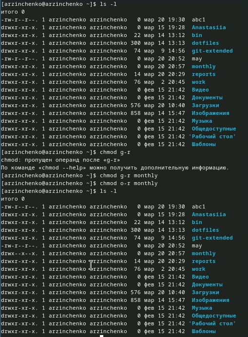{#fig:013 width=70%}

Создала файл ~/abc1 с правом записи для членов группы (рис. [-@fig:014]).

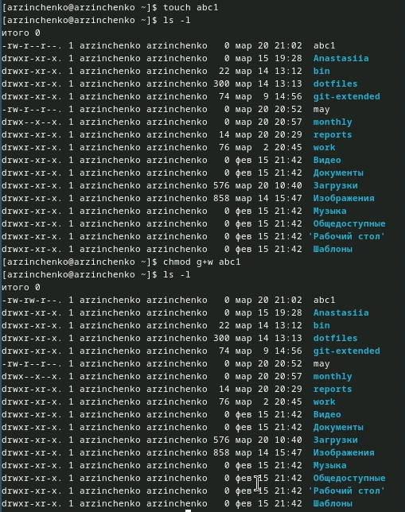{#fig:014 width=70%}

## Выполнение лабораторной работы

Для просмотра используемых в операционной системе файловых систем воспользовалась командой mount без параметров (рис. [-@fig:015]).

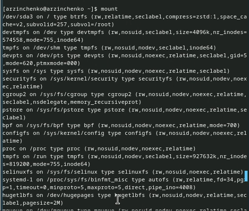{#fig:015 width=70%}

С помощью команды cat просмотрела файла/etc/fstab (рис. [-@fig:016]).

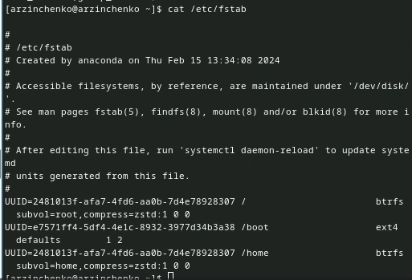{#fig:016 width=70%}

## Выполнение лабораторной работы

Воспользовалась командой df, которая вывела на экран список всех файловых систем в соответствии с именами устройств, с указанием размера и точки монтирования (рис. [-@fig:017]).

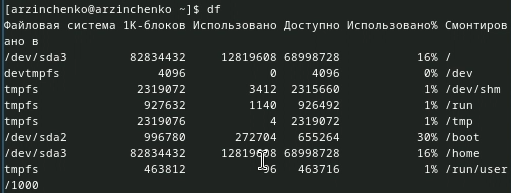{#fig:017 width=70%}

С помощью команды fsck проверила целостность файловой системы (рис. [-@fig:018]).

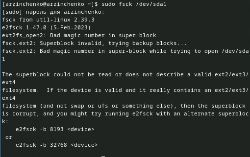{#fig:018 width=70%}

## Выполнение лабораторной работы

Скопировала файл /usr/include/sys/io.h в домашний каталог и назвала его equipment  (рис. [-@fig:019]).

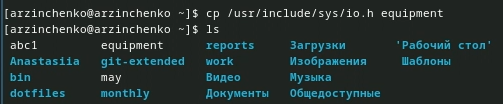{#fig:019 width=70%}

В домашнем каталоге создала директорию ~/ski.plases (рис. [-@fig:020]).

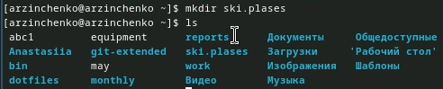{#fig:020 width=70%}

## Выполнение лабораторной работы

Переместила файл equipment в каталог ~/ski.plases (рис. [-@fig:021]).

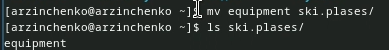{#fig:021 width=70%}

Переименовала файл ~/ski.plases/equipment в ~/ski.plases/equiplist (рис. [-@fig:022]).

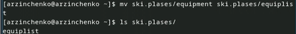{#fig:022 width=70%}

## Выполнение лабораторной работы

Создала в домашнем каталоге файл abc1 и скопировала его в каталог
~/ski.plases, назвала его equiplist2 (рис. [-@fig:023]).

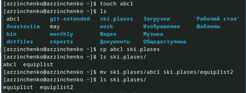{#fig:023 width=70%}

Создала каталог с именем equipment в каталоге ~/ski.plases (рис. [-@fig:024]).

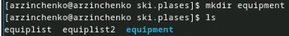{#fig:024 width=70%}

## Выполнение лабораторной работы

Переместила файлы ~/ski.plases/equiplist и equiplist2 в каталог
~/ski.plases/equipment (рис. [-@fig:025]).

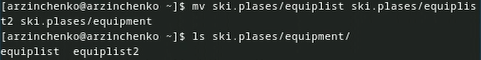{#fig:025 width=70%}

Создала и переместила каталог ~/newdir в каталог ~/ski.plases и назвала его plans (рис. [-@fig:026]).

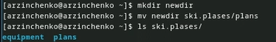{#fig:026 width=70%}

## Выполнение лабораторной работы

Определила опции команды chmod, необходимые для того, чтобы присвоить перечисленным ниже файлам выделенные права доступа, считая, что в начале таких прав -r-xr--r-- ... my_os (рис. [-@fig:029]).

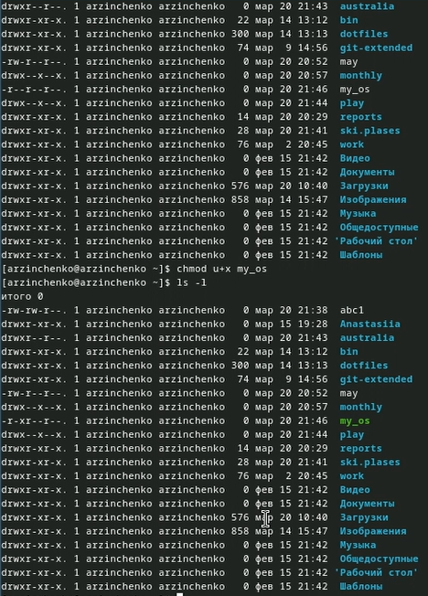{#fig:029 width=70%}

-rw-rw-r-- ... feathers (рис. [-@fig:030]).

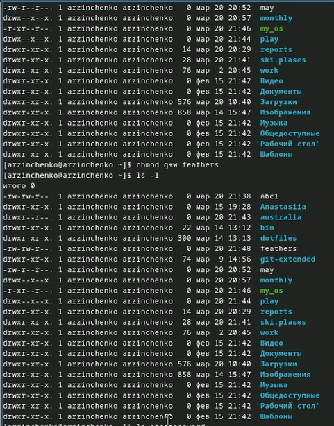{#fig:030 width=70%}

## Выполнение лабораторной работы

Просмотрла содержимое файла /etc/password (рис. [-@fig:031]).

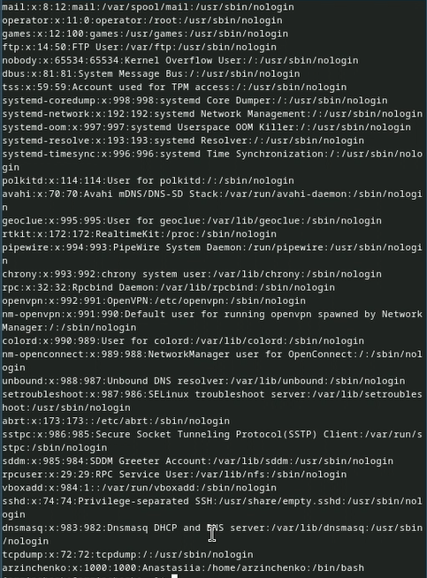{#fig:031 width=70%}

Скопировала файл ~/feathers в файл ~/file.old (рис. [-@fig:032]).

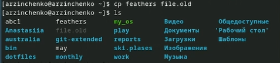{#fig:032 width=70%}

## Выполнение лабораторной работы

Переместила файл ~/file.old в каталог ~/play (рис. [-@fig:033]).

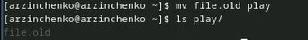{#fig:033 width=70%}

Скопировала каталог ~/play в каталог ~/fun (рис. [-@fig:034]).

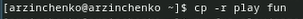{#fig:034 width=70%}

## Выполнение лабораторной работы

Переместила каталог ~/fun в каталог ~/play и назвала его games (рис. [-@fig:035]).

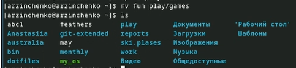{#fig:035 width=70%} 

Лишила владельца файла ~/feathers права на чтение (рис. [-@fig:036]).

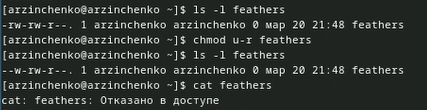{#fig:036 width=70%} 

## Выполнение лабораторной работы

Дала владельцу файла ~/feathers право на чтение (рис. [-@fig:037]).

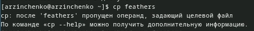{#fig:037 width=70%} 

Лишила владельца каталога ~/play права на выполнение (рис. [-@fig:038]).

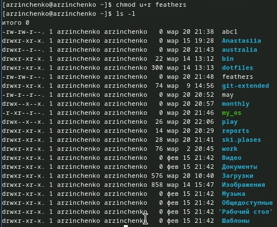{#fig:038 width=70%} 

## Выполнение лабораторной работы

Перешла в каталог ~/play (рис. [-@fig:039]).

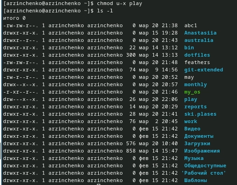{#fig:039 width=70%} 

Дала владельцу каталога ~/play право на выполнение (рис. [-@fig:040]).

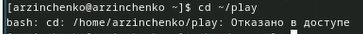{#fig:040 width=70%}
 
## Выполнение лабораторной работы
 
Прочитала man по командам mount (рис. [-@fig:041]).

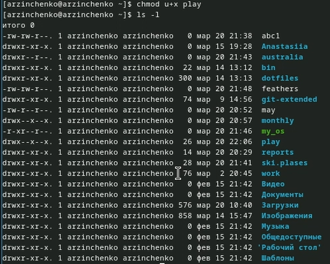{#fig:041 width=70%}

fsck (рис. [-@fig:042]).

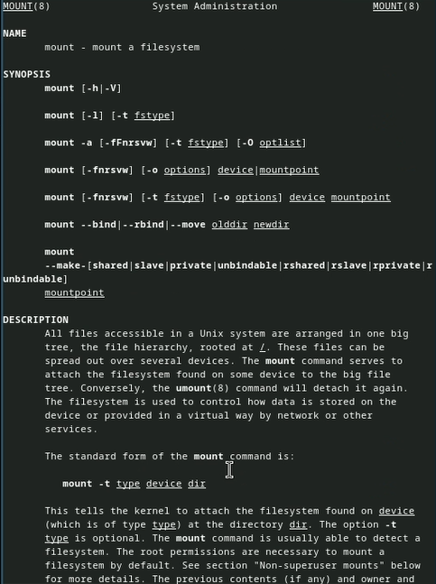{#fig:042 width=70%}

# Выводы

Я ознакомилась с файловой системой Linux, её структурой, именами и содержанием
каталогов. Приобрела практические навыки по применению команд для работы с файлами и каталогами, по управлению процессами (и работами), по проверке использования диска и обслуживанию файловой системы

# Список литературы{.unnumbered}

::: {#refs}
:::

