---
## Front matter
title: "Отчёт по лабораторной работе № 7"
subtitle: "Операционные системы"
author: "Анастасия Романовна Зинченко"

## Generic otions
lang: ru-RU
toc-title: "Содержание"

## Bibliography
bibliography: bib/cite.bib
csl: pandoc/csl/gost-r-7-0-5-2008-numeric.csl

## Pdf output format
toc: true # Table of contents
toc-depth: 2
lof: true # List of figures
lot: true # List of tables
fontsize: 12pt
linestretch: 1.5
papersize: a4
documentclass: scrreprt
## I18n polyglossia
polyglossia-lang:
  name: russian
  options:
	- spelling=modern
	- babelshorthands=true
polyglossia-otherlangs:
  name: english
## I18n babel
babel-lang: russian
babel-otherlangs: english
## Fonts
mainfont: PT Serif
romanfont: PT Serif
sansfont: PT Sans
monofont: PT Mono
mainfontoptions: Ligatures=TeX
romanfontoptions: Ligatures=TeX
sansfontoptions: Ligatures=TeX,Scale=MatchLowercase
monofontoptions: Scale=MatchLowercase,Scale=0.9
## Biblatex
biblatex: true
biblio-style: "gost-numeric"
biblatexoptions:
  - parentracker=true
  - backend=biber
  - hyperref=auto
  - language=auto
  - autolang=other*
  - citestyle=gost-numeric
## Pandoc-crossref LaTeX customization
figureTitle: "Рис."
tableTitle: "Таблица"
listingTitle: "Листинг"
lofTitle: "Список иллюстраций"
lotTitle: "Список таблиц"
lolTitle: "Листинги"
## Misc options
indent: true
header-includes:
  - \usepackage{indentfirst}
  - \usepackage{float} # keep figures where there are in the text
  - \floatplacement{figure}{H} # keep figures where there are in the text
---

# Цель работы

Ознакомиться с файловой системой Linux, её структурой, именами и содержанием
каталогов. Приобрести практические навыки по применению команд для работы с файлами и каталогами, по управлению процессами (и работами), по проверке использования диска и обслуживанию файловой системы

# Задание

1. Выполнить все примеры, приведённые в первой части описания лабораторной работы.
2. Выполнить следующие действия, зафиксировав в отчёте по лабораторной работе используемые при этом команды и результаты их выполнения
3. Определить опции команды chmod, необходимые для того, чтобы присвоить перечисленным ниже файлам выделенные права доступа, считая, что в начале таких прав нет
4. Проделать приведённые ниже упражнения, записывая в отчёт по лабораторной работе используемые при этом команды
5. Прочитать man по командам mount, fsck, mkfs, kill и кратко их охарактеризовать приведя примеры
6. Контрольные вопросы

# Выполнение лабораторной работы

Скопировала файл ~/abc1 в файл april и в файл may (рис. [-@fig:001]).

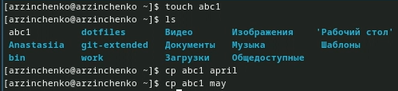{#fig:001 width=70%}

Скопировала файлы april и may в каталог monthly (рис. [-@fig:002]).

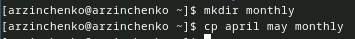{#fig:002 width=70%}

Скопировала файл monthly/may в файл с именем june (рис. [-@fig:003]).

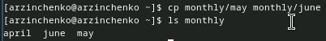{#fig:003 width=70%}

Скопировала каталог monthly в каталог monthly.00 (рис. [-@fig:004]).

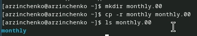{#fig:004 width=70%}

Скопировала каталог monthly.00 в каталог /tmp (рис. [-@fig:005]).

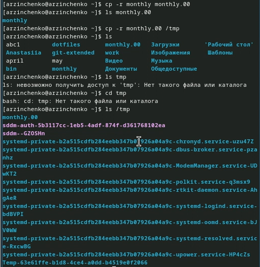{#fig:005 width=70%}

Изменила название файла april на july в домашнем каталоге (рис. [-@fig:006]).

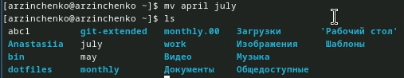{#fig:006 width=70%}

Переместила файл july в каталог monthly.00 (рис. [-@fig:007]).

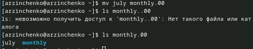{#fig:007 width=70%}

Переименовала каталог monthly.00 в monthly.01 (рис. [-@fig:008]).

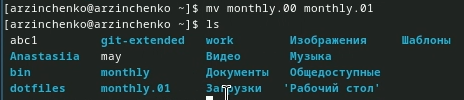{#fig:008 width=70%}

Переместила каталог monthly.01 в каталог reports (рис. [-@fig:009]).

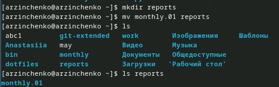{#fig:009 width=70%}

Переименовала каталог reports/monthly.01 в reports/monthly (рис. [-@fig:010]).

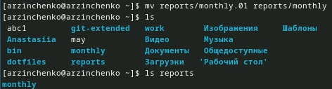{#fig:010 width=70%}

Создала файл ~/may с правом выполнения для владельца (рис. [-@fig:011]).

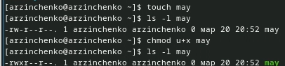{#fig:011 width=70%}

Лишила владельца файла ~/may права на выполнение (рис. [-@fig:012]).

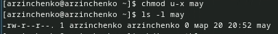{#fig:012 width=70%}

Создала каталог monthly с запретом на чтение для членов группы и всех
остальных пользователей (рис. [-@fig:013]).

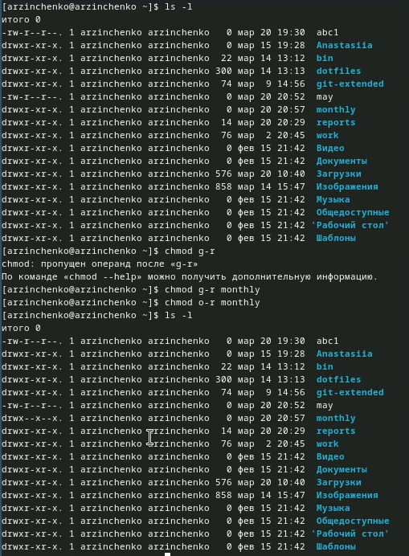{#fig:013 width=70%}

Создала файл ~/abc1 с правом записи для членов группы (рис. [-@fig:014]).

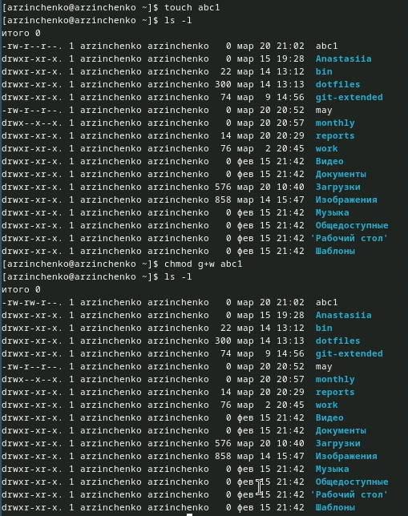{#fig:014 width=70%}

Для просмотра используемых в операционной системе файловых систем воспользовалась командой mount без параметров (рис. [-@fig:015]).

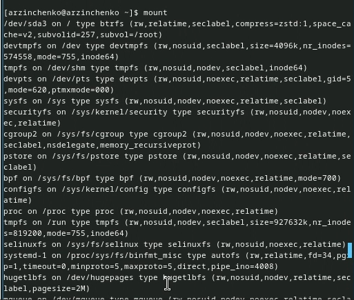{#fig:015 width=70%}

С помощью команды cat просмотрела файла/etc/fstab (рис. [-@fig:016]).

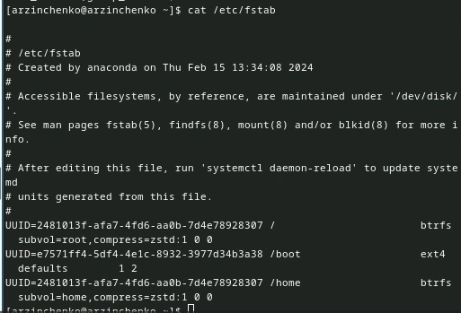{#fig:016 width=70%}

Воспользовалась командой df, которая вывела на экран список всех файловых систем в соответствии с именами устройств, с указанием размера и точки монтирования (рис. [-@fig:017]).

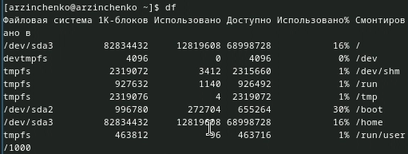{#fig:017 width=70%}

С помощью команды fsck проверила целостность файловой системы (рис. [-@fig:018]).

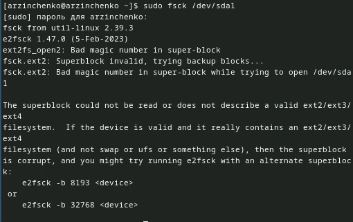{#fig:018 width=70%}

Скопировала файл /usr/include/sys/io.h в домашний каталог и назвала его equipment  (рис. [-@fig:019]).

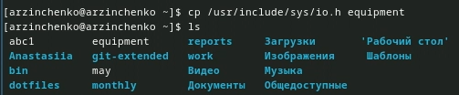{#fig:019 width=70%}

В домашнем каталоге создала директорию ~/ski.plases (рис. [-@fig:020]).

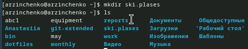{#fig:020 width=70%}

Переместила файл equipment в каталог ~/ski.plases (рис. [-@fig:021]).

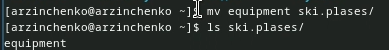{#fig:021 width=70%}

Переименовала файл ~/ski.plases/equipment в ~/ski.plases/equiplist (рис. [-@fig:022]).

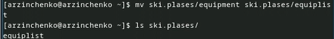{#fig:022 width=70%}

Создала в домашнем каталоге файл abc1 и скопировала его в каталог
~/ski.plases, назвала его equiplist2 (рис. [-@fig:023]).

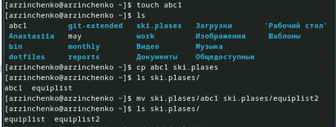{#fig:023 width=70%}

Создала каталог с именем equipment в каталоге ~/ski.plases (рис. [-@fig:024]).

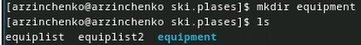{#fig:024 width=70%}

Переместила файлы ~/ski.plases/equiplist и equiplist2 в каталог
~/ski.plases/equipment (рис. [-@fig:025]).

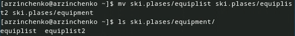{#fig:025 width=70%}

Создала и переместила каталог ~/newdir в каталог ~/ski.plases и назвала его plans (рис. [-@fig:026]).

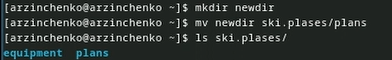{#fig:026 width=70%}

Определила опции команды chmod, необходимые для того, чтобы присвоить перечисленным ниже файлам выделенные права доступа, считая, что в начале таких прав
нет drwxr--r-- ... australia (рис. [-@fig:027]).

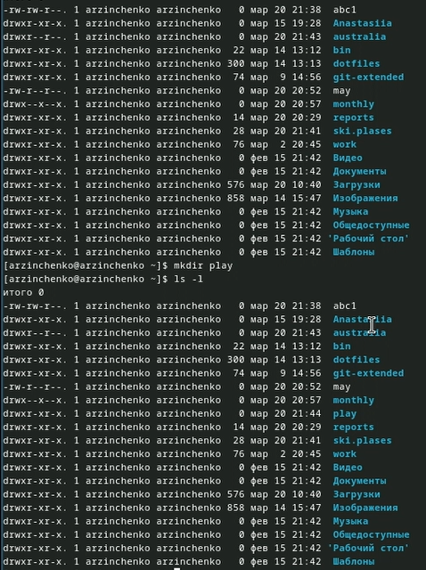{#fig:027 width=70%}

drwx--x--x ... play (рис. [-@fig:028]).

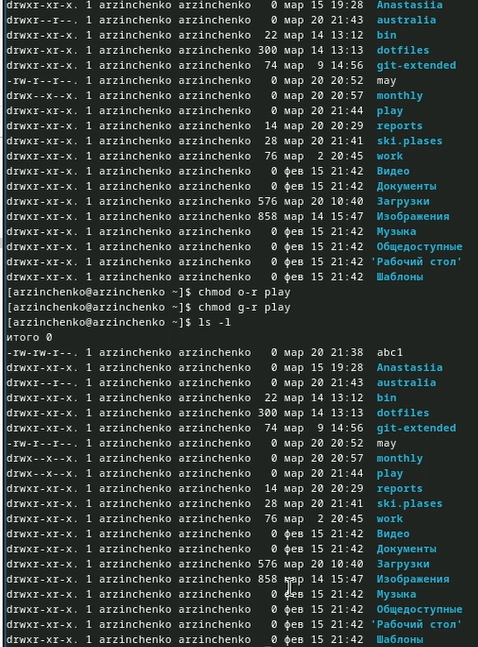{#fig:028 width=70%}

-r-xr--r-- ... my_os (рис. [-@fig:029]).

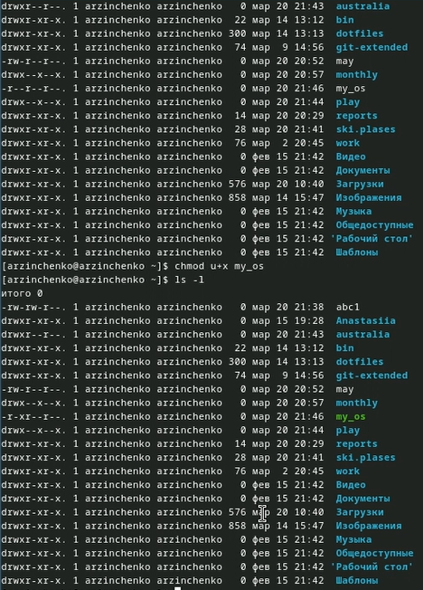{#fig:029 width=70%}

-rw-rw-r-- ... feathers (рис. [-@fig:030]).

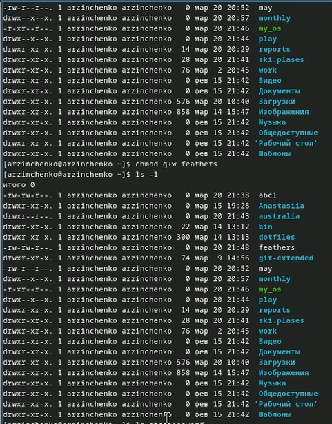{#fig:030 width=70%}

Просмотрла содержимое файла /etc/password (рис. [-@fig:031]).

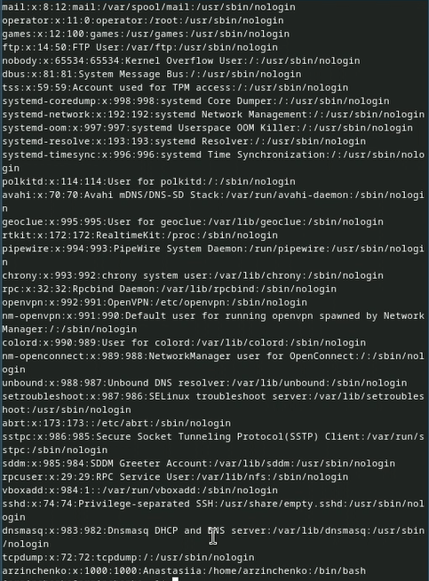{#fig:031 width=70%}

Скопировала файл ~/feathers в файл ~/file.old (рис. [-@fig:032]).

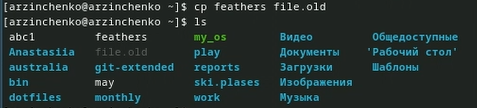{#fig:032 width=70%}

Переместила файл ~/file.old в каталог ~/play (рис. [-@fig:033]).

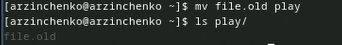{#fig:033 width=70%}

Скопировала каталог ~/play в каталог ~/fun (рис. [-@fig:034]).

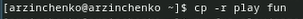{#fig:034 width=70%}

Переместила каталог ~/fun в каталог ~/play и назвала его games (рис. [-@fig:035]).

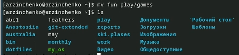{#fig:035 width=70%} 

Лишила владельца файла ~/feathers права на чтение (рис. [-@fig:036]).

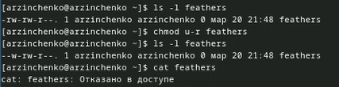{#fig:036 width=70%} 

Дала владельцу файла ~/feathers право на чтение (рис. [-@fig:037]).

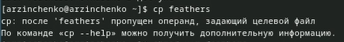{#fig:037 width=70%} 

Лишила владельца каталога ~/play права на выполнение (рис. [-@fig:038]).

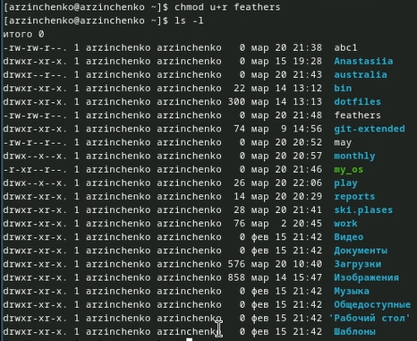{#fig:038 width=70%} 

Перешла в каталог ~/play (рис. [-@fig:039]).

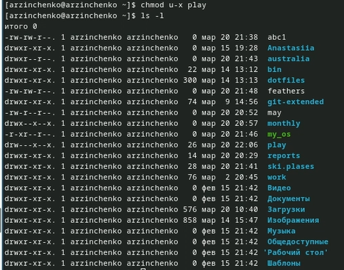{#fig:039 width=70%} 

Дала владельцу каталога ~/play право на выполнение (рис. [-@fig:040]).

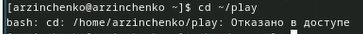{#fig:040 width=70%}
 
Прочитала man по командам mount (рис. [-@fig:041]).

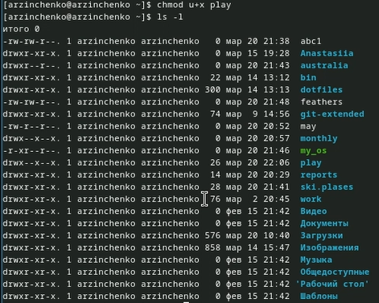{#fig:041 width=70%}

fsck (рис. [-@fig:042]).

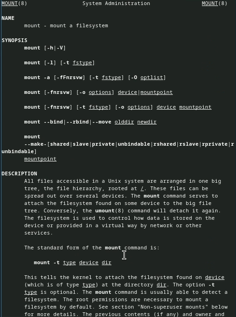{#fig:042 width=70%}

mkfs (рис. [-@fig:043]).

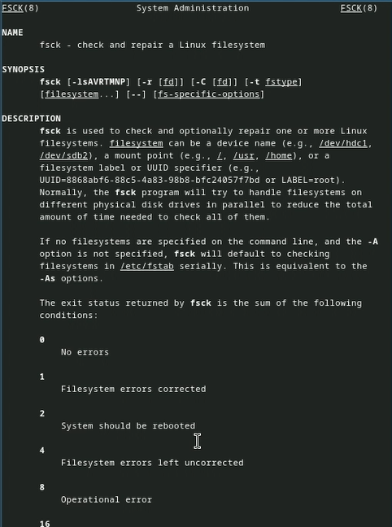{#fig:043 width=70%}

kill (рис. [-@fig:044]).

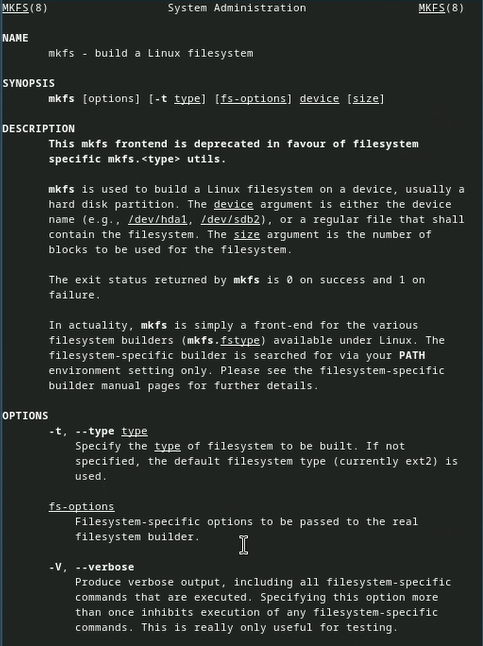{#fig:044 width=70%}

Контрольные вопрсы

1. Дайте характеристику каждой файловой системе, существующей на жёстком диске компьютера, на котором вы выполняли лабораторную работу.

    Ext2, Ext3, Ext4 или Extended Filesystem - это стандартная файловая система для Linux. Она была разработана еще для Minix. Она самая стабильная из всех существующих, кодовая база изменяется очень редко и эта файловая система содержит больше всего функций. Версия ext2 была разработана уже именно для Linux и получила много улучшений. В 2001 году вышла ext3, которая добавила еще больше стабильности благодаря использованию журналирования. В 2006 была выпущена версия ext4, которая используется во всех дистрибутивах Linux до сегодняшнего дня. В ней было внесено много улучшений, в том числе увеличен максимальный размер раздела до одного экзабайта.

    Btrfs или B-Tree File System - это совершенно новая файловая система, которая сосредоточена на отказоустойчивости, легкости администрирования и восстановления данных. Файловая система объединяет в себе очень много новых интересных возможностей, таких как размещение на нескольких разделах, поддержка подтомов, изменение размера не лету, создание мгновенных снимков, а также высокая производительность. Но многими пользователями файловая система Btrfs считается нестабильной. Тем не менее, она уже используется как файловая система по умолчанию в OpenSUSE и SUSE Linux.

2. Приведите общую структуру файловой системы и дайте характеристику каждой директории первого уровня этой структуры.

    / — root каталог. Содержит в себе всю иерархию системы;
    /bin — здесь находятся двоичные исполняемые файлы. Основные общие команды, хранящиеся отдельно от других программ в системе (прим.: pwd, ls, cat, ps);
    /boot — тут расположены файлы, используемые для загрузки системы (образ initrd, ядро vmlinuz);
    /dev — в данной директории располагаются файлы устройств (драйверов). С помощью этих файлов можно взаимодействовать с устройствами. К примеру, если это жесткий диск, можно подключить его к файловой системе. В файл принтера же можно написать напрямую и отправить задание на печать;
    /etc— в этой директории находятся файлы конфигураций программ. Эти файлы позволяют настраивать системы, сервисы, скрипты системных демонов;
    /home — каталог, аналогичный каталогу Users в Windows. Содержит домашние каталоги учетных записей пользователей (кроме root). При создании нового пользователя здесь создается одноименный каталог с аналогичным именем и хранит личные файлы этого пользователя;
    /lib — содержит системные библиотеки, с которыми работают программы и модули ядра;
    /lost+found — содержит файлы, восстановленные после сбоя работы системы. Система проведет проверку после сбоя и найденные файлы можно будет посмотреть в данном каталоге;
    /media — точка монтирования внешних носителей. Например, когда вы вставляете диск в дисковод, он будет автоматически смонтирован в директорию /media/cdrom;
    /mnt — точка временного монтирования. Файловые системы подключаемых устройств обычно монтируются в этот каталог для временного использования;
    /opt — тут расположены дополнительные (необязательные) приложения. Такие программы обычно не подчиняются принятой иерархии и хранят свои файлы в одном подкаталоге (бинарные, библиотеки, конфигурации);
    /proc — содержит файлы, хранящие информацию о запущенных процессах и о состоянии ядра ОС;
    /root — директория, которая содержит файлы и личные настройки суперпользователя;
    /run — содержит файлы состояния приложений. Например, PID-файлы или UNIX-сокеты;
    /sbin — аналогично /bin содержит бинарные файлы. Утилиты нужны для настройки и администрирования системы суперпользователем;
    /srv — содержит файлы сервисов, предоставляемых сервером (прим. FTP или Apache HTTP);
    /sys — содержит данные непосредственно о системе. Тут можно узнать информацию о ядре, драйверах и устройствах;
    /tmp — содержит временные файлы. Данные файлы доступны всем пользователям на чтение и запись. Стоит отметить, что данный каталог очищается при перезагрузке;
    /usr — содержит пользовательские приложения и утилиты второго уровня, используемые пользователями, а не системой. Содержимое доступно только для чтения (кроме root). Каталог имеет вторичную иерархию и похож на корневой;
    /var — содержит переменные файлы. Имеет подкаталоги, отвечающие за отдельные переменные. Например, логи будут храниться в /var/log, кэш в /var/cache, очереди заданий в /var/spool/ и так далее.

3. Какая операция должна быть выполнена, чтобы содержимое некоторой файловой системы было доступно операционной системе?

Монтирование тома.

4. Назовите основные причины нарушения целостности файловой системы. Как устранить повреждения файловой системы?

Отсутствие синхронизации между образом файловой системы в памяти и ее данными на диске в случае аварийного останова может привести к появлению следующих ошибок:

    Один блок адресуется несколькими mode (принадлежит нескольким файлам).
    Блок помечен как свободный, но в то же время занят (на него ссылается onode).
    Блок помечен как занятый, но в то же время свободен (ни один inode на него не ссылается).
    Неправильное число ссылок в inode (недостаток или избыток ссылающихся записей в каталогах).
    Несовпадение между размером файла и суммарным размером адресуемых inode блоков.
    Недопустимые адресуемые блоки (например, расположенные за пределами файловой системы).
    “Потерянные” файлы (правильные inode, на которые не ссылаются записи каталогов).
    Недопустимые или неразмещенные номера inode в записях каталогов.

5. Как создаётся файловая система?

Команда mkfs - позволяет создать файловую систему Linux.

6. Дайте характеристику командам для просмотра текстовых файлов.

    Cat - выводит содержимое файла на стандартное устройство вывода.
    Выполнение команды head выведет первые 10 строк текстового файла.
    Выполнение команды tail выведет последние 10 строк текстового файла.
    Команда tac - это тоже самое, что и cat, только отображает строки в обратном порядке.
    Для того, чтобы просмотреть огромный текстовый файл применяются команды для постраничного просмотра. Такие как more и less.

7. Приведите основные возможности команды cp в Linux.

Cp – копирует или перемещает директорию, файлы.

    Приведите основные возможности команды mv в Linux.

Mv - переименовывает или перемещает файл или директорию

    Что такое права доступа? Как они могут быть изменены?

Права доступа к файлу или каталогу можно изменить, воспользовавшись командой chmod. Сделать это может владелец файла (или каталога) или пользователь с правами администратора.

# Выводы

Я ознакомилась с файловой системой Linux, её структурой, именами и содержанием
каталогов. Приобрела практические навыки по применению команд для работы с файлами и каталогами, по управлению процессами (и работами), по проверке использования диска и обслуживанию файловой системы

# Список литературы{.unnumbered}

::: {#refs}
:::
