---
## Front matter
lang: ru-RU
title: Презентация
subtitle: по лабораторной работе № 8
author:
  - Зинченко А.Р
institute:
  - Российский университет дружбы народов, Москва, Россия
date: 30 марта 2024

## i18n babel
babel-lang: russian
babel-otherlangs: english

## Formatting pdf
toc: false
toc-title: Содержание
slide_level: 2
aspectratio: 169
section-titles: true
theme: metropolis
header-includes:
 - \metroset{progressbar=frametitle,sectionpage=progressbar,numbering=fraction}
 - '\makeatletter'
 - '\beamer@ignorenonframefalse'
 - '\makeatother'
---

# Информация

## Докладчик

  * Зинченко Анастасия Романовна
  * студентка НБИбд-01-23
  * Российский университет дружбы народов
  
# Цель работы

Ознакомиться с инструментами поиска файлов и фильтрации текстовых данных. Приобрести практические навыки: по управлению процессами (и заданиями), по проверке использования диска и обслуживанию файловых систем.

# Задание

1. Осуществить вход в систему, используя соответствующее имя пользователя.
2. Записать в файл file.txt названия файлов, содержащихся в каталоге /etc. Дописать в этот же файл названия файлов, содержащихся в домашнем каталоге.
3. Вывести имена всех файлов из file.txt, имеющих расширение .conf, после чего записать их в новый текстовой файл conf.txt.
4. Определить, какие файлы в домашнем каталоге имеют имена, начинавшиеся с символа c? 
5. Вывести на экран (по странично) имена файлов из каталога /etc, начинающиеся с символа h.
6. Запустить в фоновом режиме процесс, который будет записывать в файл ~/logfile файлы, имена которых начинаются с log.
7. Удалить файл ~/logfile.
8. Запустить из консоли в фоновом режиме редактор gedit.
9. Определить идентификатор процесса gedit, используя команду ps, конвейер и фильтр grep.
10. Прочитать справку (man) команды kill, после чего использовать её для завершения процесса gedit.
11. Выполнить команды df и du, предварительно получив более подробную информацию об этих командах, с помощью команды man.
12. Воспользовавшись справкой команды find, вывести имена всех директорий, имеющихся в домашнем каталоге.
13. Контрольные вопросы.

# Выполнение лабораторной работы

Осуществитвила вход в систему, используя соответствующее имя пользователя. (рис. [-@fig:001]).

{#fig:001 width=50%}

Записала в файл file.txt названия файлов, содержащихся в каталоге /etc. (рис. [-@fig:002]).

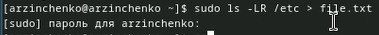{#fig:002 width=50%}

## Выполнение лабораторной работы

Дописала в этот же файл названия файлов, содержащихся в домашнем каталоге. (рис. [-@fig:003]).

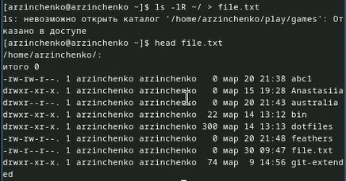{#fig:003 width=50%}

Вывела имена всех файлов из file.txt, имеющих расширение .conf. (рис. [-@fig:004]).

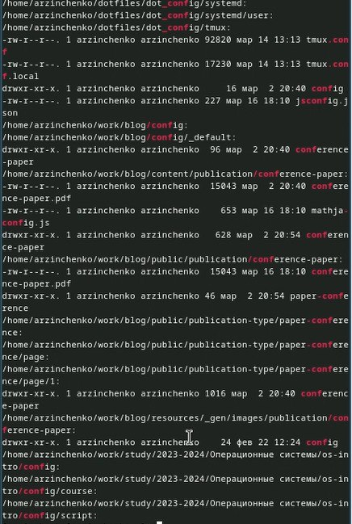{#fig:004 width=50%}

## Выполнение лабораторной работы

Записала их в новый текстовой файл conf.txt. (рис. [-@fig:005]).

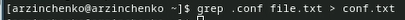{#fig:005 width=50%}

Определила, какие файлы в домашнем каталоге имеют имена, начинавшиеся с символа c. (рис. [-@fig:006]).

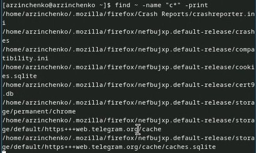{#fig:006 width=50%}

## Выполнение лабораторной работы

Вывела на экран (по странично) имена файлов из каталога /etc, начинающиеся с символа h. (рис. [-@fig:007]).

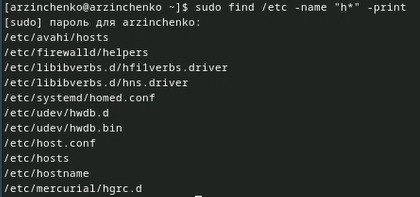{#fig:007 width=50%}

Запустила в фоновом режиме процесс, который будет записывать в файл ~/logfile файлы, имена которых начинаются с log. (рис. [-@fig:008]).

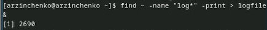{#fig:008 width=50%}

## Выполнение лабораторной работы

Удалила файл ~/logfile. (рис. [-@fig:009]).

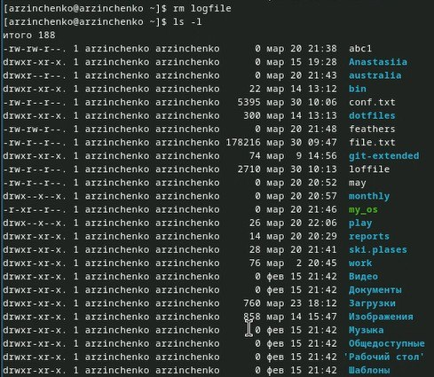{#fig:009 width=50%}

Запустила из консоли в фоновом режиме редактор gedit. (рис. [-@fig:010]).

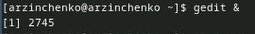{#fig:010 width=50%}

## Выполнение лабораторной работы

Определила идентификатор процесса gedit, используя команду ps, конвейер и фильтр grep. (рис. [-@fig:011]).

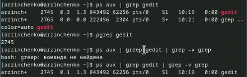{#fig:011 width=50%}

Прочитала справку (man) команды kill. (рис. [-@fig:012]).

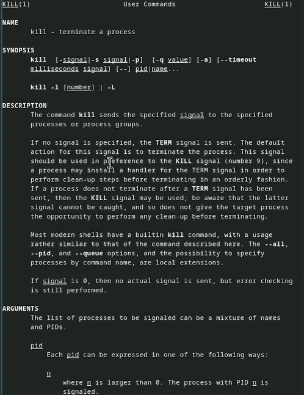{#fig:012 width=50%}

## Выполнение лабораторной работы

Использовала команду kill для завершения процесса gedit. (рис. [-@fig:013]).

{#fig:013 width=50%}

Прочитала справку команды df. (рис. [-@fig:014]).

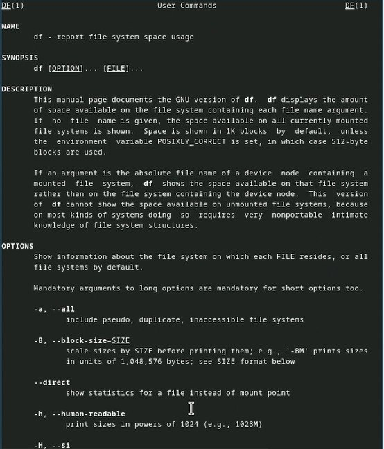{#fig:014 width=50%}

## Выполнение лабораторной работы

Прочитала справку команды du. (рис. [-@fig:015]).

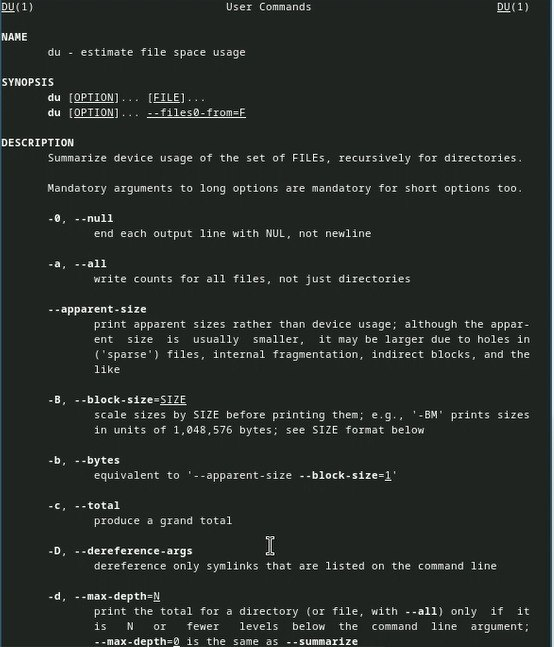{#fig:015 width=50%}

Выполнила команды df и du. (рис. [-@fig:016]).

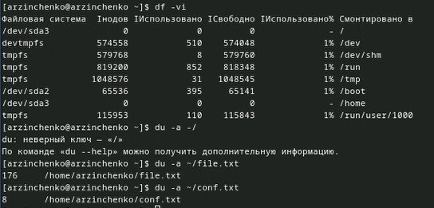{#fig:016 width=50%}

## Выполнение лабораторной работы

Прочитала справку команды find. (рис. [-@fig:017]).

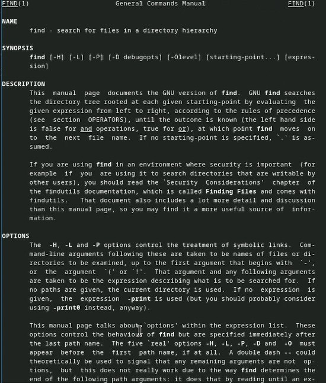{#fig:017 width=50%}

Вывела имена всех директорий, имеющихся в домашнем каталоге. (рис. [-@fig:018]).

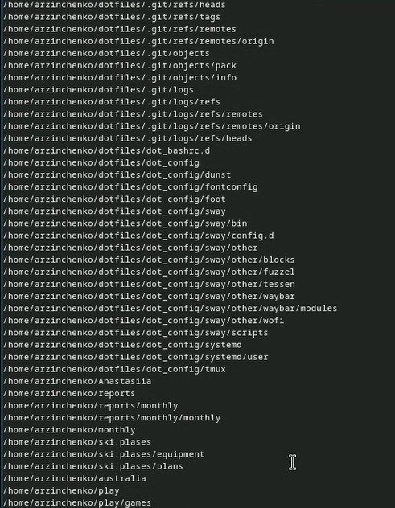{#fig:018 width=50%}

# Выводы

Я ознакомилась с инструментами поиска файлов и фильтрации текстовых данных. Приобрела практические навыки: по управлению процессами (и заданиями), по проверке использования диска и обслуживанию файловых систем.

