---
## Front matter
title: "Отчёт по лабораторной работе № 9"
subtitle: "Операционные системы"
author: "Анастасия Романовна Зинченко"

## Generic otions
lang: ru-RU
toc-title: "Содержание"

## Bibliography
bibliography: bib/cite.bib
csl: pandoc/csl/gost-r-7-0-5-2008-numeric.csl

## Pdf output format
toc: true # Table of contents
toc-depth: 2
lof: true # List of figures
lot: true # List of tables
fontsize: 12pt
linestretch: 1.5
papersize: a4
documentclass: scrreprt
## I18n polyglossia
polyglossia-lang:
  name: russian
  options:
	- spelling=modern
	- babelshorthands=true
polyglossia-otherlangs:
  name: english
## I18n babel
babel-lang: russian
babel-otherlangs: english
## Fonts
mainfont: PT Serif
romanfont: PT Serif
sansfont: PT Sans
monofont: PT Mono
mainfontoptions: Ligatures=TeX
romanfontoptions: Ligatures=TeX
sansfontoptions: Ligatures=TeX,Scale=MatchLowercase
monofontoptions: Scale=MatchLowercase,Scale=0.9
## Biblatex
biblatex: true
biblio-style: "gost-numeric"
biblatexoptions:
  - parentracker=true
  - backend=biber
  - hyperref=auto
  - language=auto
  - autolang=other*
  - citestyle=gost-numeric
## Pandoc-crossref LaTeX customization
figureTitle: "Рис."
tableTitle: "Таблица"
listingTitle: "Листинг"
lofTitle: "Список иллюстраций"
lotTitle: "Список таблиц"
lolTitle: "Листинги"
## Misc options
indent: true
header-includes:
  - \usepackage{indentfirst}
  - \usepackage{float} # keep figures where there are in the text
  - \floatplacement{figure}{H} # keep figures where there are in the text
---

# Цель работы

Освоить основныу возможности командной оболочки Midnight Commander. Приобрести навыки практической работы по просмотру каталогов и файлов; манипуляций с ними.

# Задание

1. Изучить информацию о mc, вызвав в командной строке man mc.
2. Запустить из командной строки mc, изучить его структуру и меню.
3. Выполнить несколько операций в mc, используя управляющие клавиши (операции
с панелями; выделение/отмена выделения файлов, копирование/перемещение фай-
лов, получение информации о размере и правах доступа на файлы и/или каталоги
и т.п.)
4. Выполнить основные команды меню левой (или правой) панели. 
5. Используя возможности подменю Файл , выполнить:
– просмотр содержимого текстового файла;
– редактирование содержимого текстового файла (без сохранения результатов
редактирования);
– создание каталога;
– копирование в файлов в созданный каталог.
6. С помощью соответствующих средств подменю Команда осуществить:
– поиск в файловой системе файла с заданными условиями (например, файла
с расширением .c или .cpp, содержащего строку main);
– выбор и повторение одной из предыдущих команд;
– переход в домашний каталог;
– анализ файла меню и файла расширений.
7. Вызовать подменю Настройки . Освоить операции, определяющие структуру экрана mc (Full screen, Double Width, Show Hidden Files и т.д.)
8. Создать текстовой файл text.txt.
9. Открыть этот файл с помощью встроенного в mc редактора.
10. Вставить в открытый файл небольшой фрагмент текста, скопированный из любого другого файла или Интернета.
11. Проделать с текстом следующие манипуляции, используя горячие клавиши:
 11.1. Удалить строку текста.
 11.2. Выделить фрагмент текста и скопировать его на новую строку.
 11.3. Выделить фрагмент текста и перенести его на новую строку.
 11.4. Сохранить файл.
 11.5. Отменить последнее действие.
 11.6. Перейти в конец файла (нажав комбинацию клавиш) и написать некоторый текст.
 11.7. Перейти в начало файла (нажав комбинацию клавиш) и написать некоторый текст.
 11.8. Сохранить и закрыть файл.
12. Открыть файл с исходным текстом на некотором языке программирования (например C или Java)
13. Используя меню редактора, включить подсветку синтаксиса, если она не включена, или выключить, если она включена

# Выполнение лабораторной работы

Изучила информацию о mc, вызвав в командной строке man mc. (рис. [-@fig:001]).

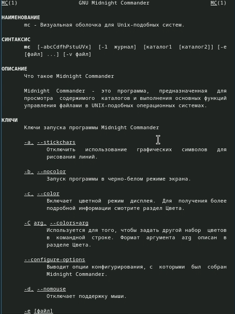{#fig:001 width=70%}

Запустила из командной строки mc, изучила его структуру и меню. (рис. [-@fig:002]).

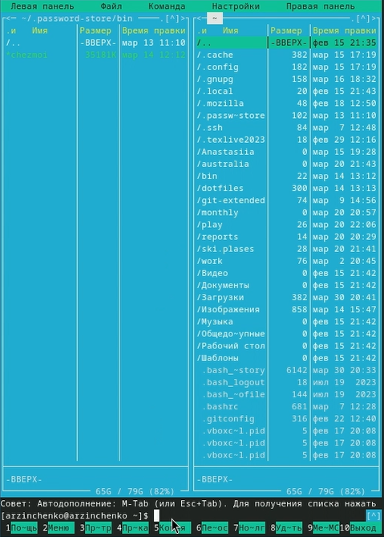{#fig:002 width=70%}

Выполнила несколько операций в mc, используя управляющие клавиши (операции с панелями; выделение/отмена выделения файлов, копирование/перемещение файлов, получение информации о размере и правах доступа на файлы и/или каталоги и т.п.) (рис. [-@fig:003]).

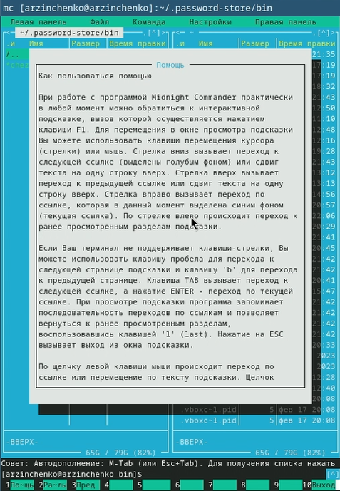{#fig:003 width=70%}

Выполнила основные команды меню левой панели. (рис. [-@fig:004]).

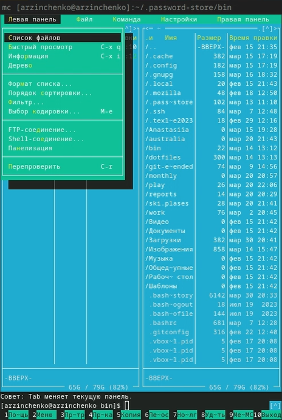{#fig:004 width=70%}

Используя возможности подменю Файл , выполнила:
– просмотр содержимого текстового файла; 
– редактирование содержимого текстового файла (без сохранения результатов редактирования);
– создание каталога; 
– копирование в файлов в созданный каталог. (рис. [-@fig:005]).

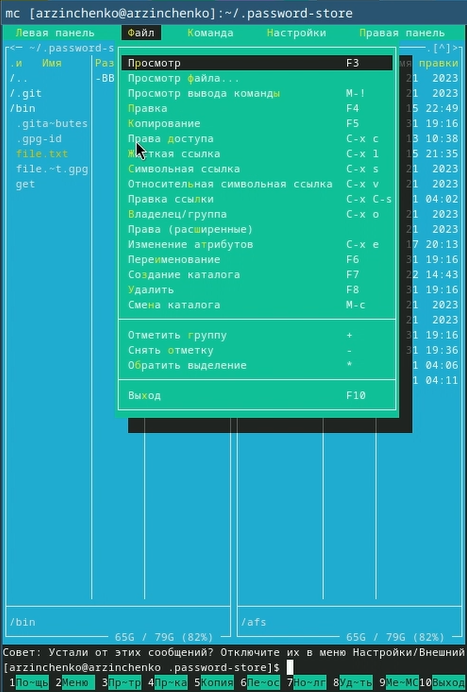{#fig:005 width=70%}

С помощью соответствующих средств подменю Команда осуществила:
– поиск в файловой системе файла с заданными условиями (например, файла
с расширением .c или .cpp, содержащего строку main);
– выбор и повторение одной из предыдущих команд;
– переход в домашний каталог;
– анализ файла меню и файла расширений. (рис. [-@fig:006]).

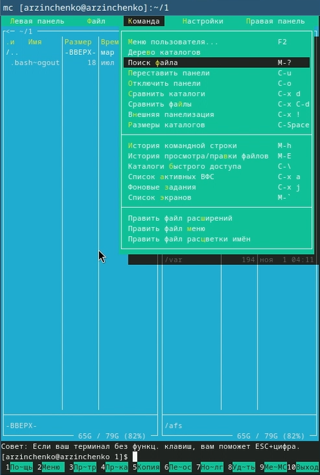{#fig:006 width=70%}

Вызвала подменю Настройки . Освоила операции, определяющие структуру экрана mc (Full screen, Double Width, Show Hidden Files и т.д.) (рис. [-@fig:007]).

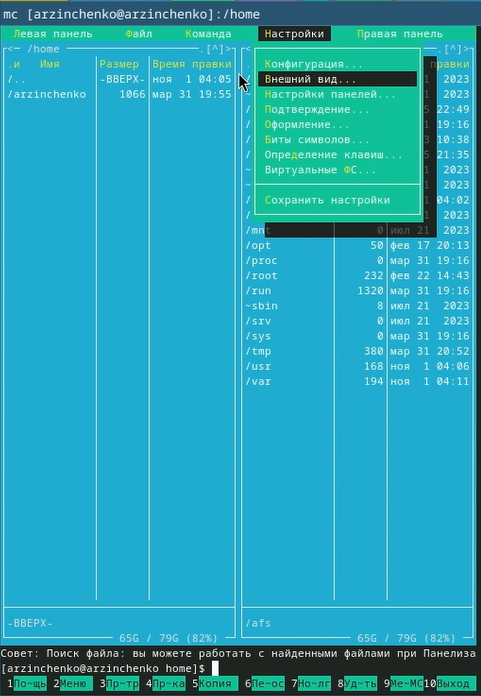{#fig:007 width=70%}

Создала текстовой файл text.txt. (рис. [-@fig:008]).

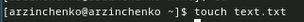{#fig:008 width=70%}

Открыла этот файл с помощью встроенного в mc редактора. (рис. [-@fig:009]).

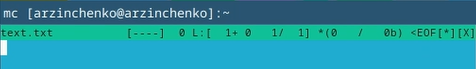{#fig:009 width=70%}

Вставbkf в открытый файл небольшой фрагмент текста, скопированный из Интернета. (рис. [-@fig:010]).

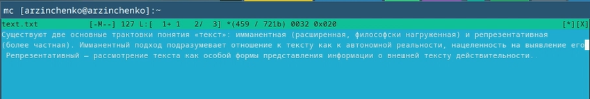{#fig:010 width=70%}

Проделала с текстом следующие манипуляции, используя горячие клавиши:
 Удалила строку текста. (рис. [-@fig:011]).

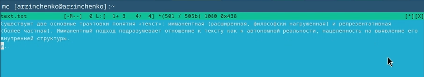{#fig:011 width=70%}

 Выделила фрагмент текста и скопировала его на новую строку. (рис. [-@fig:012]).

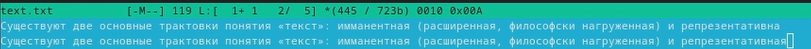{#fig:012 width=70%}

 Выделила фрагмент текста и перенесла его на новую строку. (рис. [-@fig:013]).

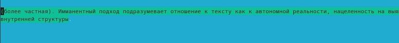{#fig:013 width=70%}

 Сохранила файл. (рис. [-@fig:014]).

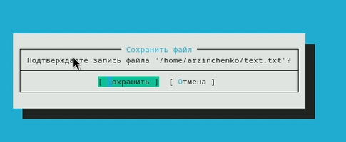{#fig:014 width=70%}

 Отменила последнее действие. (рис. [-@fig:015]).

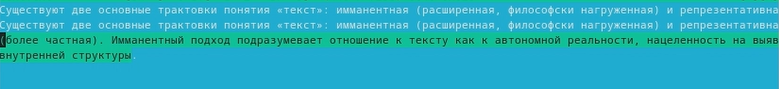{#fig:015 width=70%}

 Перешла в конец файла и написала некоторый текст. (рис. [-@fig:016]).

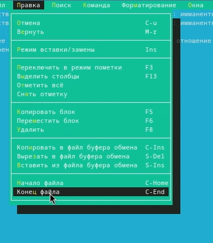{#fig:016 width=70%}

 Перешла в начало файла и написала некоторый текст. (рис. [-@fig:017]).

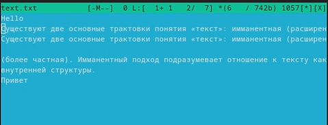{#fig:017 width=70%}

 Сохранила и закрыла файл. (рис. [-@fig:018]).

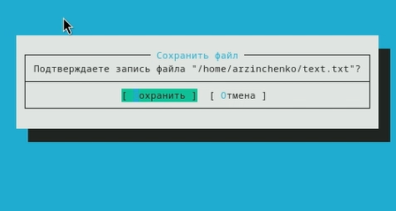{#fig:018 width=70%}

Открыла файл с исходным текстом на C. (рис. [-@fig:019]).

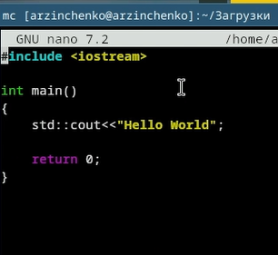{#fig:019 width=70%}

Используя меню редактора, выключила подсветку синтаксиса. (рис. [-@fig:020]).

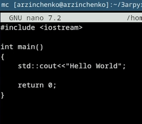{#fig:020 width=70%}
 

# Выводы

Я освоила  основные возможности командной оболочки Midnight Commander. Приобрела навыки практической работы по просмотру каталогов и файлов; манипуляций с ними.

# Список литературы{.unnumbered}

::: {#refs}
:::
