---
## Front matter
lang: ru-RU
title: Лабораторная работа
subtitle: № 11
author:
  - Зинченко А.Р
institute:
  - Российский университет дружбы народов, Москва, Россия
date: 20 апреля 2024

## i18n babel
babel-lang: russian
babel-otherlangs: english

## Formatting pdf
toc: false
toc-title: Содержание
slide_level: 2
aspectratio: 169
section-titles: true
theme: metropolis
header-includes:
 - \metroset{progressbar=frametitle,sectionpage=progressbar,numbering=fraction}
 - '\makeatletter'
 - '\beamer@ignorenonframefalse'
 - '\makeatother'
---

# Информация

## Докладчик

  * Зинченко Анастасия Романовна
  * студентка НБИбд-01-23
  * Российский университет дружбы народов

# Цель работы

Познакомиться с операционной системой Linux. Получить практические навыки работы с редактором Emacs.

# Задание

1. Ознакомиться с теоретическим материалом.
2. Ознакомиться с редактором emacs.
3. Выполнить упражнения.
4. Ответить на контрольные вопросы.

# Выполнение лабораторной работы

Скачала emacs. (рис. [-@fig:001]).

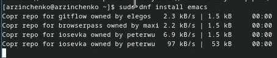{#fig:001 width=50%}

## Выполнение лабораторной работы

Открыла emacs. (рис. [-@fig:002]).

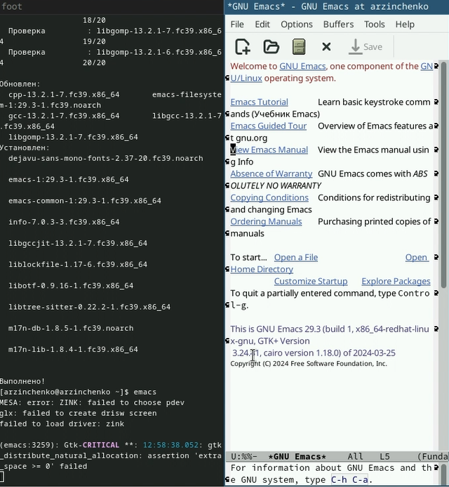{#fig:002 width=50%}

## Выполнение лабораторной работы

Создала файл lab07.sh с помощью комбинации Ctrl-x Ctrl-f. (рис. [-@fig:002]).

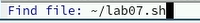{#fig:003 width=50%}

## Выполнение лабораторной работы

Набрала текст (рис. [-@fig:004]).

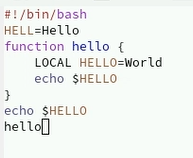{#fig:004 width=50%}

## Выполнение лабораторной работы

Cохранила файл с помощью комбинации Ctrl-x Ctrl-s. (рис. [-@fig:005]).

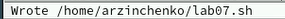{#fig:005 width=50%}

## Выполнение лабораторной работы

Вырезала одной командой целую строку (С-k). (рис. [-@fig:006]).

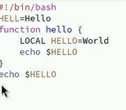{#fig:006 width=50%}

## Выполнение лабораторной работы

Вставила эту строку в конец файла (C-y). (рис. [-@fig:007]).

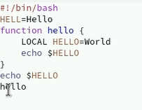{#fig:007 width=50%}

## Выполнение лабораторной работы

Выделила область текста (C-space). (рис. [-@fig:008]).

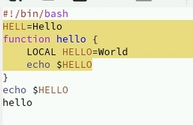{#fig:008 width=50%}

## Выполнение лабораторной работы

Скопировала область в буфер обмена (M-w) и вставила область в конец файла. (рис. [-@fig:009]).

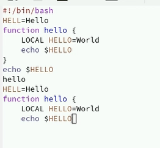{#fig:009 width=50%}

## Выполнение лабораторной работы

Вновь выделила эту область и на этот раз вырезала её (C-w). (рис. [-@fig:010]).

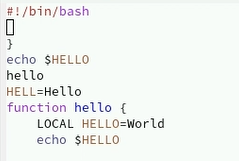{#fig:010 width=50%} 

## Выполнение лабораторной работы

Отменила последнее действие (C-/). (рис. [-@fig:011]).

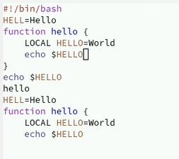{#fig:011 width=50%} 

## Выполнение лабораторной работы

Переместила курсор в начало строки (C-a). (рис. [-@fig:012]).

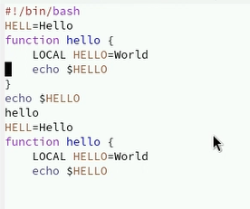{#fig:012 width=50%} 

## Выполнение лабораторной работы

Переместила курсор в конец строки (C-e). (рис. [-@fig:013]).

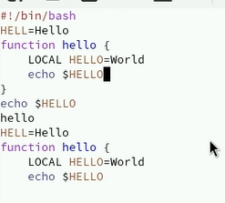{#fig:013 width=50%} 

## Выполнение лабораторной работы

Переместила курсор в начало буфера (M-<). (рис. [-@fig:014]).

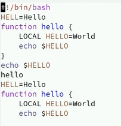{#fig:014 width=50%} 

## Выполнение лабораторной работы

Переместила курсор в конец буфера (M->). (рис. [-@fig:015]).

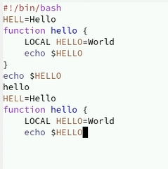{#fig:015 width=50%} 

## Выполнение лабораторной работы

Вывела список активных буферов на экран (C-x C-b). (рис. [-@fig:016]).

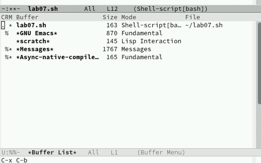{#fig:016 width=50%} 

## Выполнение лабораторной работы

Переместилась во вновь открытое окно (C-x) o со списком открытых буферов и переключитесь на другой буфер. (рис. [-@fig:017]).

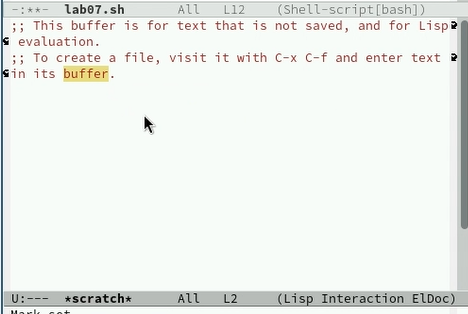{#fig:017 width=50%} 

## Выполнение лабораторной работы

Закрыла это окно (C-x 0). (рис. [-@fig:018]).

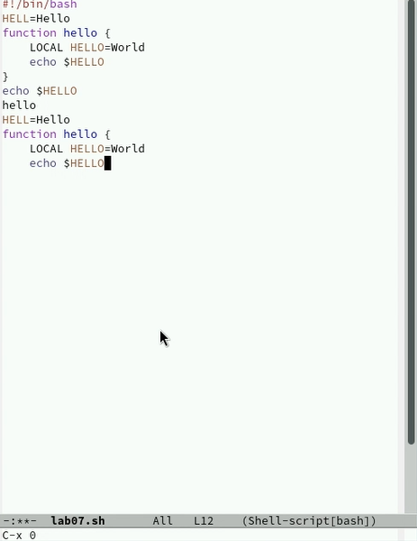{#fig:018 width=50%} 

## Выполнение лабораторной работы

Теперь вновь переключилась между буферами, но уже без вывода их списка на экран (C-x b). (рис. [-@fig:019]).

{#fig:019 width=50%} 

## Выполнение лабораторной работы

Поделила фрейм на 4 части: разделила фрейм на два окна по вертикали (C-x 3), а затем каждое из этих окон на две части по горизонтали (C-x 2). (рис. [-@fig:020]).

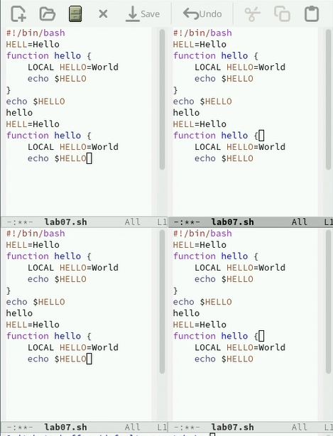{#fig:020 width=50%} 

## Выполнение лабораторной работы

В каждом из четырёх созданных окон открыла новый буфер (файл) и ввела несколько строк текста. (рис. [-@fig:021]).

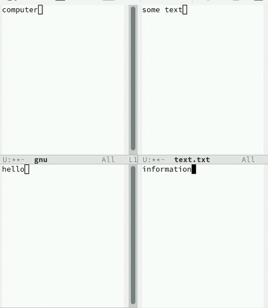{#fig:021 width=50%} 

## Выполнение лабораторной работы

Переключилась в режим поиска (C-s) и нашла несколько слов, присутствующих в тексте. (рис. [-@fig:022]).

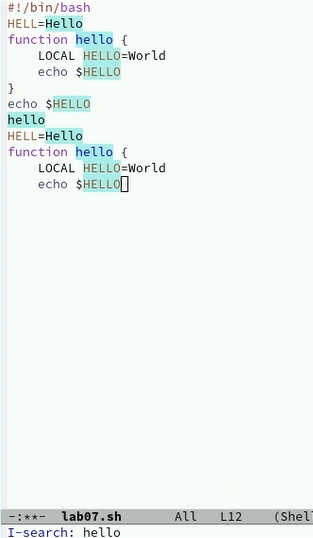{#fig:022 width=50%} 

## Выполнение лабораторной работы

Переключилась между результатами поиска, нажимая C-s. (рис. [-@fig:023]).

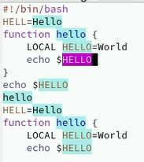{#fig:023 width=50%} 

## Выполнение лабораторной работы

Вышла из режима поиска, нажав C-g. (рис. [-@fig:024]).

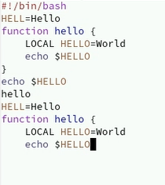{#fig:024 width=50%} 

## Выполнение лабораторной работы

Перешла в режим поиска и замены (M-%), ввела текст, который следует найти и заменить, нажала Enter, затем ввела текст для замены. (рис. [-@fig:025]).

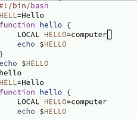{#fig:025 width=50%} 

## Выполнение лабораторной работы

Испробовала другой режим поиска, нажав M-s o. (рис. [-@fig:026]).

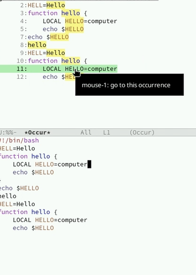{#fig:026 width=50%} 

# Выводы

Я познакомилась с операционной системой Linux. Получила практические навыки работы с редактором Emacs.

# Список литературы{.unnumbered}

::: {#refs}
:::
