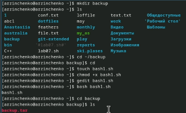
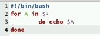
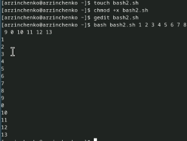
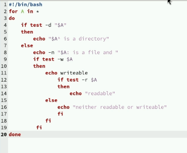
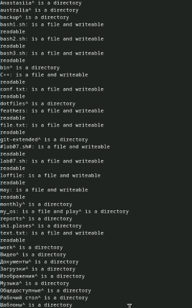
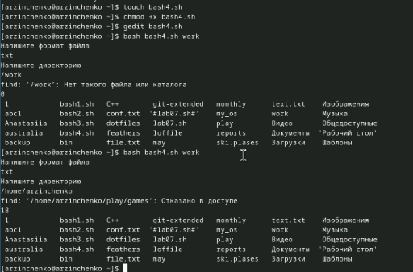

---
## Front matter
lang: ru-RU
title: Презентация по лабораторной работе № 12
subtitle: Операционные сисетмы
author:
  - Зинченко А.Р
institute:
  - Российский университет дружбы народов, Москва, Россия
date: 27 апреля 2024

## i18n babel
babel-lang: russian
babel-otherlangs: english

## Formatting pdf
toc: false
toc-title: Содержание
slide_level: 2
aspectratio: 169
section-titles: true
theme: metropolis
header-includes:
 - \metroset{progressbar=frametitle,sectionpage=progressbar,numbering=fraction}
 - '\makeatletter'
 - '\beamer@ignorenonframefalse'
 - '\makeatother'
---

# Информация

## Докладчик

  * Зинченко Анастасия Романовна
  * студентка НБИбд-01-23
  * Российский университет дружбы народов

# Цель работы

Изучить основы программирования в оболочке OC UNIX/Linux. Научиться писать небольшие командные файлы.

# Задание

1. Написать скрипт, который при запуске будет делать резервную копию самого себя (то есть файл, в котором содержится его исходный код) в другую директорию backup в моем домашнем каталоге. При этом файл должен архивироваться одним из архиваторов на выбор zip, bzip2, tar. Способ использования команд архивации необходимо узнать, изучив справку. 
2. Написать пример командного файла, обрабатывающего любое произвольное число аргументов командной строки, в том числе превышающее 10. 
3. Написать командный файл - аналог команды ls (без использования самой этой команды и команды dir). Требуется, чтобы он выдавал информацию о нужном каталоге и выводил информацию о возможностях доступа к файлам этого каталога.
4. Написать командный файл, который получает в качестве аргумента командной строки формат файла и вычисляет количество таких файлов в указанной директории. Путь к директории также передаётся в виде аргумента командной строки.

# Выполнение лабораторной работы

Написала скрипт, который при запуске будет делать резервную копию самого себя (то есть файл, в котором содержится его исходный код) в другую директорию backup в моем домашнем каталоге. (рис. [-@fig:001]), (рис. [-@fig: 002]).

{#fig:001 width=50%}

## Выполнение лабораторной работы

{#fig:002 width=50%}

## Выполнение лабораторной работы

Написала пример командного файла, обрабатывающего любое произвольное число аргументов командной строки, в том числе превышающее 10. (рис. [-@fig:003]), (рис. [-@fig: 004]).

{#fig:003 width=50%}

## Выполнение лабораторной работы

{#fig:004 width=50%}

## Выполнение лабораторной работы

Написала командный файл - аналог команды ls (без использования самой этой команды и команды dir). (рис. [-@fig:005]), (рис. [-@fig: 006]).

{#fig:005 width=50%}

## Выполнение лабораторной работы

{#fig:006 width=50%}

## Выполнение лабораторной работы

Написала командный файл, который получает в качестве аргумента командной строки формат файла и вычисляет количество таких файлов в указанной директории. (рис. [-@fig:007]).

{#fig:007 width=50%}

# Выводы

Я изучила основы программирования в оболочке OC UNIX/Linux. Научилаась писать небольшие командные файлы.

# Список литературы{.unnumbered}

::: {#refs}
:::
