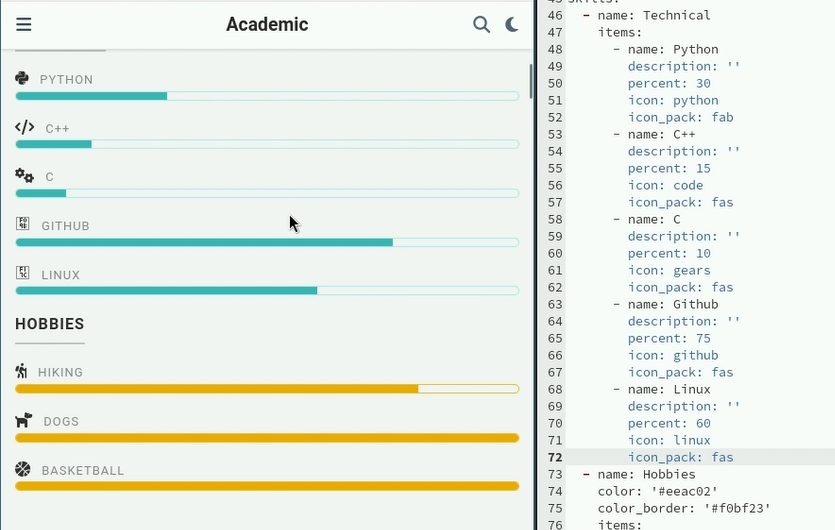
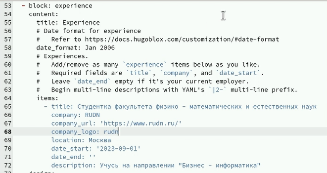
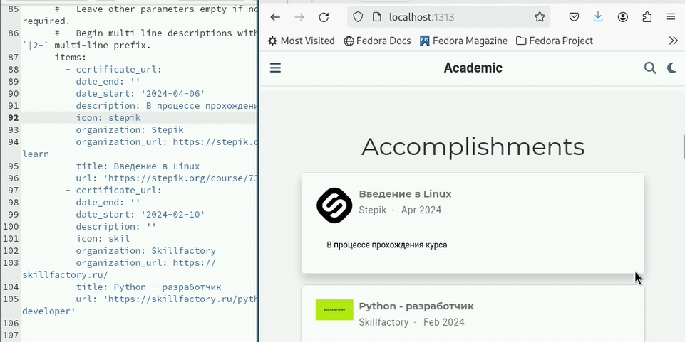
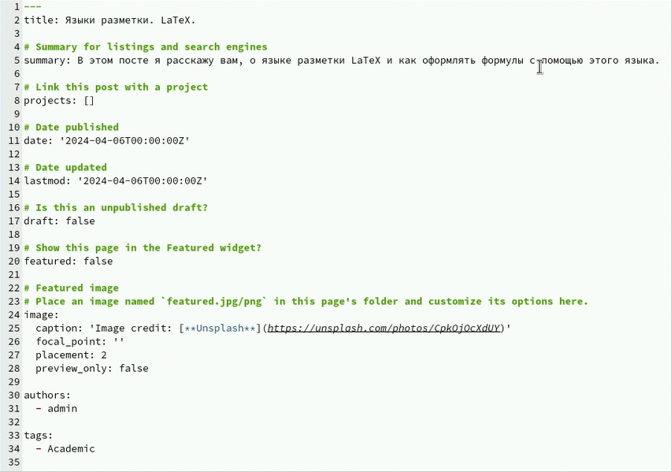
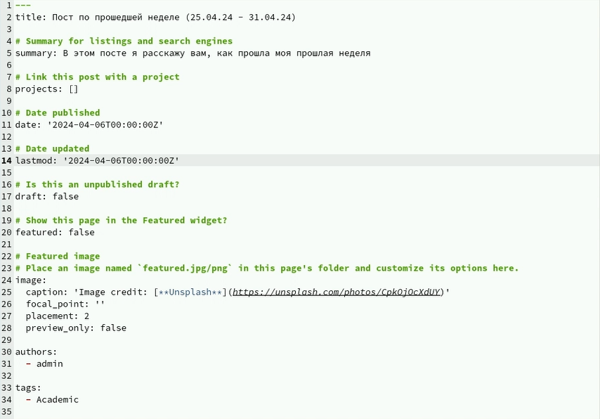

---
## Front matter
lang: ru-RU
title: Презентация
subtitle: индивидуальный проект. Этап № 3
author:
  - Зинченко А.Р
institute:
  - Российский университет дружбы народов, Москва, Россия
  - Объединённый институт ядерных исследований, Дубна, Россия
date: 06 апреля 2024

## i18n babel
babel-lang: russian
babel-otherlangs: english

## Formatting pdf
toc: false
toc-title: Содержание
slide_level: 2
aspectratio: 169
section-titles: true
theme: metropolis
header-includes:
 - \metroset{progressbar=frametitle,sectionpage=progressbar,numbering=fraction}
 - '\makeatletter'
 - '\beamer@ignorenonframefalse'
 - '\makeatother'
---

# Информация

## Докладчик

  * Зинченко Анастасия Романовна
  * студентка НБИбд-01-23
  * Российский университет дружбы народов

# Цель работы

Добавить к сайту достижения

# Задание

1. Добавить информацию о навыках (Skills).
2. Добавить информацию об опыте (Experience).
3. Добавить информацию о достижениях (Accomplishments).
4. Сделать пост по прошедшей неделе.
5. Добавить пост по теме: "Языки разметки. LaTeX."

# Выполнение индивидуального проекта

Добавила информацию о навыках (Skills) (рис. [-@fig:001]).

{#fig:001 width=50%}

## Выполнение индивидуального проекта

Добавила информацию об опыте (Experience) (рис. [-@fig:002]).

{#fig:002 width=50%}

## Выполнение индивидуального проекта

Добавила информацию о достижениях (Accomplishments) (рис. [-@fig:003]).

{#fig:003 width=50%}

## Выполнение индивидуального проекта

Сделала пост по прошедшей неделе (рис. [-@fig:004]).

{#fig:004 width=50%}

## Выполнение индивидуального проекта

Добавила пост по теме: "Языки разметки. LaTeX." (рис. [-@fig:005]).

{#fig:005 width=50%}

# Выводы
 
Я добавила достижения на сайт

# Список литературы{.unnumbered}

::: {#refs}
:::
